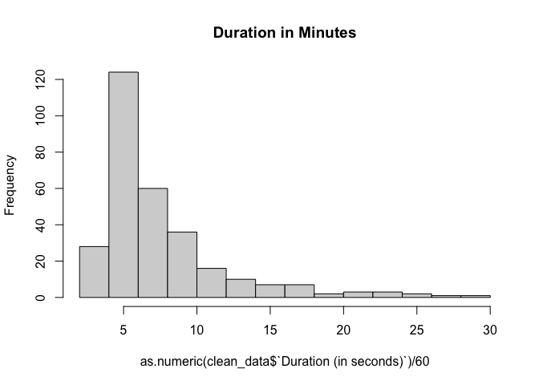
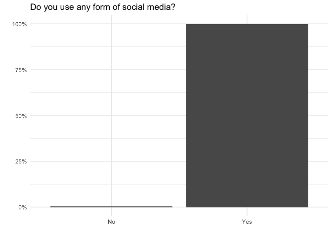
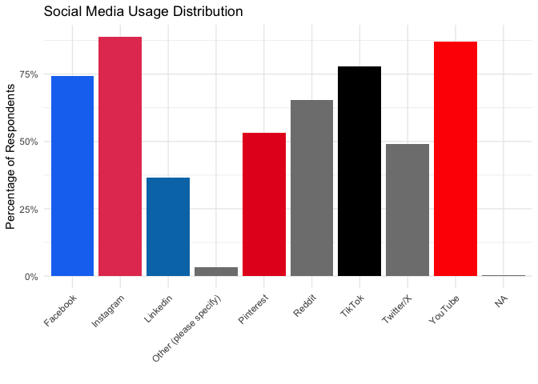
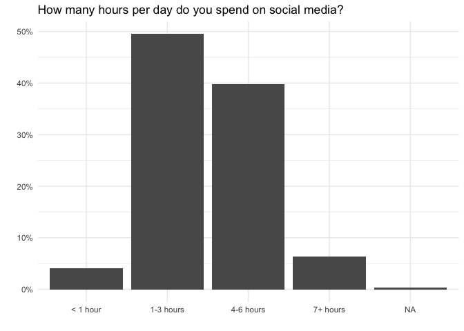
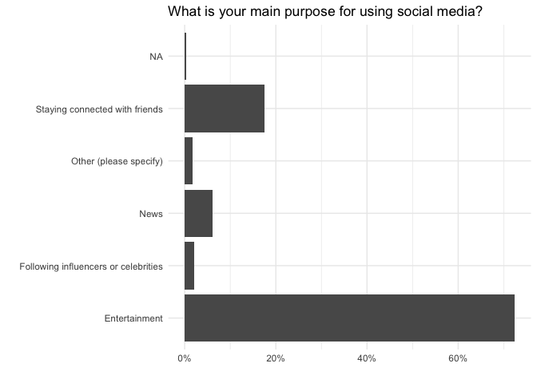

Influencer Marketing Study 2
================
2025-03-17

- [Social Media Usage](#social-media-usage)
- [Influencer vs Brand](#influencer-vs-brand)
- [Purchase Likelihood](#purchase-likelihood)
- [Mood](#mood)
- [Social State Self Esteem](#social-state-self-esteem)
- [Appearance State Self Esteem](#appearance-state-self-esteem)
- [Stimuli](#stimuli)
- [Demographics](#demographics)

Upload data, select rows and columns

``` r
data <- read_csv("../Data/im_study2_results.csv")
```

    ## Rows: 318 Columns: 90
    ## ── Column specification ────────────────────────────────────────────────────────
    ## Delimiter: ","
    ## chr (90): StartDate, EndDate, Status, IPAddress, Progress, Duration (in seco...
    ## 
    ## ℹ Use `spec()` to retrieve the full column specification for this data.
    ## ℹ Specify the column types or set `show_col_types = FALSE` to quiet this message.

``` r
data <- data[3:318,]

clean_data <- data %>% select(-StartDate, -EndDate, -Status, -Progress, -Finished, -RecordedDate, -RecipientFirstName, -RecipientLastName, -RecipientEmail, -ExternalReference, -DistributionChannel, -UserLanguage, -LocationLatitude, -LocationLongitude)
```

Remove respondents that are not female, finished too quickly or failed
attention checks for brand & product

``` r
clean_data <- clean_data %>% filter(Q22=="Female")

hist(as.numeric(clean_data$`Duration (in seconds)`)/60, main="Duration in Minutes")
```

<!-- -->

``` r
min(as.numeric(clean_data$`Duration (in seconds)`)/60)
```

    ## [1] 3.466667

``` r
mean(as.numeric(clean_data$`Duration (in seconds)`)/60)
```

    ## [1] 7.517278

``` r
median(as.numeric(clean_data$`Duration (in seconds)`)/60)
```

    ## [1] 5.975

``` r
#pass attention check
clean_data <- clean_data %>% filter(Q14=="Cup")

#who posted the ad?
clean_data %>% group_by(Q42) %>% dplyr::summarise(n=n())
```

    ## # A tibble: 4 × 2
    ##   Q42                       n
    ##   <chr>                 <int>
    ## 1 Brand                    78
    ## 2 Celebrity                 5
    ## 3 I don't know/remember     5
    ## 4 Influencer              209

``` r
#who was the influencer?
clean_data %>% group_by(Q16) %>% dplyr::summarise(n=n())
```

    ## # A tibble: 5 × 2
    ##   Q16                       n
    ##   <chr>                 <int>
    ## 1 Alix Earle                7
    ## 2 I don't know/remember    56
    ## 3 Kirsten Davies            4
    ## 4 Sienna Blake            142
    ## 5 <NA>                     88

``` r
#who was the brand?
clean_data %>% group_by(Q58) %>% dplyr::summarise(n=n())
```

    ## # A tibble: 2 × 2
    ##   Q58       n
    ##   <chr> <int>
    ## 1 Siply    78
    ## 2 <NA>    219

# Social Media Usage

``` r
clean_data %>%
  ggplot(aes(x=Q1, y=after_stat(prop), group=1)) + 
  geom_bar() + 
  scale_y_continuous(labels = scales::percent_format()) +  # Convert to percentage format
  labs(y="", x="", title="Do you use any form of social media?") + theme_minimal()
```

<!-- -->

``` r
#other includes reddit, youtube, twitter, tumblr, blue sky, discord, snapchat, and a couple others 
#unique(clean_data$Q5_6_TEXT)

# Separate multiple selections into individual rows
social_media_counts <- clean_data %>%
  separate_rows(Q5, sep = ",") %>%  # Split at commas into separate rows
  count(Q5) %>%  # Count occurrences of each platform
  mutate(percent = (n /nrow(clean_data)) * 100)  # Calculate percentage

social_media_colors <- c(
  "Facebook" = "#1877F2",    # Facebook Blue
  "Instagram" = "#E4405F",   # Instagram Pink/Red
  "TikTok" = "#000000",      # TikTok Black
  "Pinterest" = "#E60023",   # Pinterest Red
  "Linkedin" = "#0077B5",    # LinkedIn Blue
  "Twitter" = "#1DA1F2",     # Twitter Blue
  "Snapchat" = "#FFFC00",    # Snapchat Yellow
  "YouTube" = "#FF0000"      # YouTube Red
)

social_media_counts %>% arrange(percent) %>% 
  ggplot(aes(x=Q5, y=percent, fill=Q5)) + 
  geom_col(show.legend = FALSE) +  # Use geom_col() since we precomputed counts
  scale_y_continuous(labels = scales::percent_format(scale = 1)) +  # Format percentages
  labs(y="Percentage of Respondents", x="", 
       title="Social Media Usage Distribution") + 
  theme_minimal() +  # Use geom_col() for precomputed counts
  scale_fill_manual(values = social_media_colors) + theme(axis.text.x = element_text(angle = 45, hjust = 1))
```

<!-- -->

``` r
clean_data %>%
  ggplot(aes(x=Q6, y=after_stat(prop), group=1)) + 
  geom_bar() + 
  scale_y_continuous(labels = scales::percent_format()) +  # Convert to percentage format
  labs(y="", x="", title="How many hours per day do you spend on social media?") + theme_minimal()
```

<!-- -->

``` r
clean_data %>%
  ggplot(aes(x=Q20, y=after_stat(prop), group=1, fill=Q20)) + 
  geom_bar() + 
  scale_y_continuous(labels = scales::percent_format()) +  # Convert to percentage format
  labs(y="", x="", title="What is your main purpose for using social media?") + theme_minimal() + coord_flip()
```

    ## Warning: The following aesthetics were dropped during statistical transformation: fill.
    ## ℹ This can happen when ggplot fails to infer the correct grouping structure in
    ##   the data.
    ## ℹ Did you forget to specify a `group` aesthetic or to convert a numerical
    ##   variable into a factor?

<!-- -->
Influencer Content

``` r
#how often do you interact with influencer content

#which influencers do you know
```

# Influencer vs Brand

Only 51% of those assigned to the brand group correctly identified that
it was the brand who posted the advertisement. 98% of those assigned to
the influencer group correctly identified that an influencer posted the
ad (the rest chose celebrity). Of those who selected an influencer
posted the brand (from either treatment group) 68% correctly chose
Sienna Blake as the influencer, and about 27% said they don’t know or
remember. Of those who said the brand posted, 100% correctly identified
the brand as Siply.

``` r
clean_data %>% group_by(adType) %>% summarise(n=n()/nrow(clean_data))
```

    ## # A tibble: 2 × 2
    ##   adType         n
    ##   <chr>      <dbl>
    ## 1 Brand      0.508
    ## 2 Influencer 0.492

``` r
brand_data <- clean_data %>% filter(adType=="Brand")
brand_data %>% group_by(Q42) %>% summarise(n=n()/nrow(brand_data))
```

    ## # A tibble: 4 × 2
    ##   Q42                        n
    ##   <chr>                  <dbl>
    ## 1 Brand                 0.517 
    ## 2 Celebrity             0.0199
    ## 3 I don't know/remember 0.0331
    ## 4 Influencer            0.430

``` r
influencer_data <- clean_data %>% filter(adType=="Influencer")
influencer_data %>% group_by(Q42) %>% summarise(n=n()/nrow(influencer_data))
```

    ## # A tibble: 2 × 2
    ##   Q42             n
    ##   <chr>       <dbl>
    ## 1 Celebrity  0.0137
    ## 2 Influencer 0.986

``` r
clean_data %>%
  filter(!is.na(Q16)) %>%
  group_by(Q16) %>%
  summarise(n = n()) %>%
  mutate(percent = scales::percent(n / sum(n)))
```

    ## # A tibble: 4 × 3
    ##   Q16                       n percent
    ##   <chr>                 <int> <chr>  
    ## 1 Alix Earle                7 3.3%   
    ## 2 I don't know/remember    56 26.8%  
    ## 3 Kirsten Davies            4 1.9%   
    ## 4 Sienna Blake            142 67.9%

``` r
clean_data %>%
  filter(!is.na(Q58)) %>%
  group_by(Q58) %>%
  summarise(n = n()) %>%
  mutate(percent = scales::percent(n / sum(n)))
```

    ## # A tibble: 1 × 3
    ##   Q58       n percent
    ##   <chr> <int> <chr>  
    ## 1 Siply    78 100%

# Purchase Likelihood

Q69_1: Across all respondents about 30% said they were unlikely to
purchase the siply cup, 26% said likely and 22% said very unlikely.
There is a not a statistically significant difference in purchase
likelihood between the influencer and the brand group. “prop 1” is brand
and “prop 2” is influencer. What about those who thought it was
influencer vs those who thought it was a brand? There is still not a
statistically significant difference in purchase likelihood between
those who thought it was a brand or those who thought it was an
influencer (“prop 2” is influencer is a little higher).

``` r
clean_data %>% group_by(Q69_1) %>% summarise(n=n()/nrow(clean_data))
```

    ## # A tibble: 5 × 2
    ##   Q69_1                            n
    ##   <chr>                        <dbl>
    ## 1 Likely                      0.263 
    ## 2 Neither likely nor unlikely 0.138 
    ## 3 Unlikely                    0.293 
    ## 4 Very likely                 0.0842
    ## 5 Very unlikely               0.222

``` r
clean_data <- clean_data %>%
  mutate(purchase_binary = ifelse(Q69_1 %in% c("Likely", "Very likely"), 1, 0))

summary_df <- clean_data %>%
  filter(!is.na(purchase_binary), !is.na(adType)) %>%
  group_by(adType) %>%
  summarise(n = n(), n_yes = sum(purchase_binary), prop = mean(purchase_binary))

# Proportion test
prop.test(x = summary_df$n_yes, n = summary_df$n)
```

    ## 
    ##  2-sample test for equality of proportions with continuity correction
    ## 
    ## data:  summary_df$n_yes out of summary_df$n
    ## X-squared = 0.076341, df = 1, p-value = 0.7823
    ## alternative hypothesis: two.sided
    ## 95 percent confidence interval:
    ##  -0.09295445  0.13695336
    ## sample estimates:
    ##    prop 1    prop 2 
    ## 0.3576159 0.3356164

``` r
#based on their response instead of actual 
summary_df2 <- clean_data %>%
  filter(!is.na(purchase_binary), Q42 %in% c("Brand", "Influencer")) %>%
  group_by(Q42) %>%
  summarise(n = n(), n_yes = sum(purchase_binary), prop = mean(purchase_binary))

# Proportion test
prop.test(x = summary_df2$n_yes, n = summary_df2$n)
```

    ## 
    ##  2-sample test for equality of proportions with continuity correction
    ## 
    ## data:  summary_df2$n_yes out of summary_df2$n
    ## X-squared = 0.2729, df = 1, p-value = 0.6014
    ## alternative hypothesis: two.sided
    ## 95 percent confidence interval:
    ##  -0.17150633  0.08832635
    ## sample estimates:
    ##    prop 1    prop 2 
    ## 0.3076923 0.3492823

# Mood

Numeric T test: Those who saw the influencer ad were statistically
significant (at 90% level) higher mean values of Determined, Excited,
Inspired, Alert, Active, Strong, Proud, Scared, Afraid, Upset, Guilty,
and Hostile. Those who saw the influencer ad were statistically
significant (at 95% level) higher mean values of Determined, Excited,
Inspired, Alert, Active, Strong, Proud, Scared, Guilty, and Hostile.

``` r
likert_to_num <- function(x) {
  recode(x,
    "Very slightly or not at all" = 1,
    "A little" = 2,
    "Moderately" = 3,
    "Quite a bit" = 4,
    "Extremely" = 5,
    .default = NA_real_
  )
}

mood_items <- c("Q37_1", "Q37_2", "Q37_3", "Q37_4", "Q37_5", "Q37_6", "Q37_7", "Q76_1", "Q76_2", "Q76_3", "Q76_4", "Q76_5", "Q76_6", "Q76_7", "Q80_1", "Q80_2", "Q80_3", "Q80_4", "Q80_5", "Q80_6" )

clean_data[mood_items] <- lapply(clean_data[mood_items], likert_to_num)

results <- lapply(mood_items, function(item) {
  t.test(as.formula(paste(item, "~ adType")), data = clean_data)
})

results_summary <- data.frame(
  item = mood_items,
  p_value = sapply(results, \(x) x$p.value),
  mean_brand = sapply(results, \(x) x$estimate[1]),
  mean_influencer = sapply(results, \(x) x$estimate[2])
)

sig10_moods <- c("Determined", "Excited", "Inspired", "Alert", "Active", "Strong", "Proud", "Scared", "Afraid", "Upset", "Guilty", "Hostile")
results_summary %>% filter(p_value < .10) %>% bind_cols(sig10_moods)
```

    ## New names:
    ## • `` -> `...5`

    ##     item      p_value mean_brand mean_influencer       ...5
    ## 1  Q37_3 0.0218918037   2.463576        2.828767 Determined
    ## 2  Q37_4 0.0067789456   2.119205        2.547945    Excited
    ## 3  Q37_5 0.0004207831   2.251656        2.828767   Inspired
    ## 4  Q37_6 0.0002523488   2.913907        3.458904      Alert
    ## 5  Q37_7 0.0111013389   2.562914        2.958904     Active
    ## 6  Q76_1 0.0256859389   2.423841        2.767123     Strong
    ## 7  Q76_2 0.0013665140   2.258278        2.773973      Proud
    ## 8  Q76_4 0.0364785985   1.139073        1.308219     Scared
    ## 9  Q76_5 0.0791763233   1.139073        1.260274     Afraid
    ## 10 Q76_6 0.0548673637   1.158940        1.287671      Upset
    ## 11 Q80_4 0.0108545300   1.132450        1.294521     Guilty
    ## 12 Q80_6 0.0123328518   1.092715        1.239726    Hostile

``` r
sig5_moods <- c("Determined", "Excited", "Inspired", "Alert", "Active", "Strong", "Proud", "Scared", "Guilty", "Hostile")
results_summary %>% filter(p_value < .05) %>% bind_cols(sig5_moods)
```

    ## New names:
    ## • `` -> `...5`

    ##     item      p_value mean_brand mean_influencer       ...5
    ## 1  Q37_3 0.0218918037   2.463576        2.828767 Determined
    ## 2  Q37_4 0.0067789456   2.119205        2.547945    Excited
    ## 3  Q37_5 0.0004207831   2.251656        2.828767   Inspired
    ## 4  Q37_6 0.0002523488   2.913907        3.458904      Alert
    ## 5  Q37_7 0.0111013389   2.562914        2.958904     Active
    ## 6  Q76_1 0.0256859389   2.423841        2.767123     Strong
    ## 7  Q76_2 0.0013665140   2.258278        2.773973      Proud
    ## 8  Q76_4 0.0364785985   1.139073        1.308219     Scared
    ## 9  Q80_4 0.0108545300   1.132450        1.294521     Guilty
    ## 10 Q80_6 0.0123328518   1.092715        1.239726    Hostile

Non-parametric Wilcoxon Test: Those in the influencer group are
statistically significantly (5% level) higher in moods Determined,
Excited, Inspired, Alert, Active, Strong, Proud, and Hostile. (does not
have scared and guilty like t test did)

``` r
results2 <- lapply(mood_items, function(item) {
  wilcox.test(as.formula(paste(item, "~ adType")), data = clean_data)
})

results_summary2 <- data.frame(
  item = mood_items,
  p_value = sapply(results2, \(x) x$p.value),
  mean_brand = sapply(mood_items, function(item) {
    mean(clean_data[[item]][clean_data$adType == "Brand"], na.rm = TRUE)
  }),
  mean_influencer = sapply(mood_items, function(item) {
    mean(clean_data[[item]][clean_data$adType == "Influencer"], na.rm = TRUE)
  })
)

wilcox_sig_moods <- c("Determined", "Excited", "Inspired", "Alert", "Active", "Strong", "Proud", "Hostile")

results_summary2 %>% filter(p_value<0.05) %>% bind_cols(wilcox_sig_moods)
```

    ## New names:
    ## • `` -> `...5`

    ##        item      p_value mean_brand mean_influencer       ...5
    ## Q37_3 Q37_3 0.0282891844   2.463576        2.828767 Determined
    ## Q37_4 Q37_4 0.0050097762   2.119205        2.547945    Excited
    ## Q37_5 Q37_5 0.0004584357   2.251656        2.828767   Inspired
    ## Q37_6 Q37_6 0.0001848643   2.913907        3.458904      Alert
    ## Q37_7 Q37_7 0.0105953186   2.562914        2.958904     Active
    ## Q76_1 Q76_1 0.0202667708   2.423841        2.767123     Strong
    ## Q76_2 Q76_2 0.0011151448   2.258278        2.773973      Proud
    ## Q80_6 Q80_6 0.0080936487   1.092715        1.239726    Hostile

# Social State Self Esteem

Only the “I feel self concious” is higher for those who were in the
influencer group at the 10% significance level. No differences at the 5%
significance level.

``` r
likert_to_num <- function(x) {
  recode(x,
    "1 (Not at all)" = 1,
    "2 (A little bit)" = 2,
    "3 (Somewhat)" = 3,
    "4 (Very much)" = 4,
    "5 (Extremely)" = 5,
    .default = NA_real_
  )
}

social_items <- c("Q17_1", "Q17_2", "Q17_3", "Q17_4", "Q17_5", "Q17_6", "Q17_7")

clean_data[social_items] <- lapply(clean_data[social_items], likert_to_num)

results3 <- lapply(social_items, function(item) {
  t.test(as.formula(paste(item, "~ adType")), data = clean_data)
})

results_summary3 <- data.frame(
  item = social_items,
  p_value = sapply(results3, \(x) x$p.value),
  mean_brand = sapply(results3, \(x) x$estimate[1]),
  mean_influencer = sapply(results3, \(x) x$estimate[2])
)

#no significant difference at the 5% level in social state self esteem
results_summary3 %>% filter(p_value < .05)
```

    ## [1] item            p_value         mean_brand      mean_influencer
    ## <0 rows> (or 0-length row.names)

``` r
# I feel self concious is higher for those who saw the influencer ad at the 10% significance level 
results_summary3 %>% filter(p_value < .10)
```

    ##    item    p_value mean_brand mean_influencer
    ## 1 Q17_2 0.07947252   2.761589        3.047945

# Appearance State Self Esteem

At the 95% significance level, those who saw the influencer ad rated
higher on “I feel good about myself” and “I am pleased with my
appearance right now”. Those who saw the brand ad rated higher on “I
feel unattractive”.

``` r
appearance_items <- c("Q59_1", "Q59_2", "Q59_3", "Q59_4", "Q59_5", "Q59_6")

clean_data[appearance_items] <- lapply(clean_data[appearance_items], likert_to_num)

results4 <- lapply(appearance_items, function(item) {
  t.test(as.formula(paste(item, "~ adType")), data = clean_data)
})

results_summary4 <- data.frame(
  item = appearance_items,
  p_value = sapply(results4, \(x) x$p.value),
  mean_brand = sapply(results4, \(x) x$estimate[1]),
  mean_influencer = sapply(results4, \(x) x$estimate[2])
)

#At the 95% significance level, those who saw the influencer ad rated higher on "I feel good about myself" and "I am pleased with my appearance right now". Those who saw the brand ad rated higher on "I feel unattractive". 
results_summary4 %>% filter(p_value < .05)
```

    ##    item    p_value mean_brand mean_influencer
    ## 1 Q59_4 0.03954470   2.801325        3.095890
    ## 2 Q59_5 0.01151773   2.602649        2.972603
    ## 3 Q59_6 0.02700213   2.569536        2.212329

# Stimuli

# Demographics
