Influencer Marketing Survey 1
================
2025-03-15

- [Read in Data](#read-in-data)
- [Fix Column Names](#fix-column-names)
- [Filter the Data](#filter-the-data)
- [Recode the self-esteem Question](#recode-the-self-esteem-question)
- [Self-esteem](#self-esteem)
- [Overview of Demographics](#overview-of-demographics)
- [Describing the Data](#describing-the-data)
- [Parasocial Relationships](#parasocial-relationships)
- [Brand Ratings](#brand-ratings)
- [T-tests](#t-tests)

# Read in Data

# Fix Column Names

# Filter the Data

``` r
# only females
survey_data <- survey_data %>%
  filter(Gender == "Female")

# filter out people who took less than 60 seconds
survey_data <- survey_data %>%
  filter(Duration_sec > 120)

# product check
survey_data <- survey_data %>%
  filter(ProductCheck == "Athletic Apparel") 

# brand check... just get lulu and old navy responses
survey_data <- survey_data %>%
  filter(BrandCheck %in% c("Lululemon", "Old Navy"))

# really check if they chose the right brand they were assigned (Q52 is old navy) 
old_navy <- survey_data %>% filter(BrandCheck=="Old Navy") %>% 
  filter(!is.na(`X..ImportId...QID53_FIRST_CLICK..`))
lulu <- survey_data %>% filter(BrandCheck=="Lululemon") %>% 
  filter(!is.na(`X..ImportId...QID52_FIRST_CLICK..`))
# found 2 that need to be removed...2 people assigned old navy chose lululemon
survey_data <- survey_data %>%
  filter(!RecordId %in% c("R_6hEhLNwdVlnzpJa", "R_3DvtWI0jOKAgPAd"))

#head(survey_data, 10)
```

95.3% of respondents use social media. The median amount of time the
survey took was 219.5 seconds (~ 3 minutes and 40 seconds). 315
respondents passed the attention checks (87%).

``` r
# percentage of respondents who use social media 
raw_data %>%
  count(X..ImportId...QID1..) %>%
  mutate(percent = (n / nrow(raw_data)) * 100)
```

    ##   X..ImportId...QID1..   n   percent
    ## 1                        9  2.472527
    ## 2                   No   8  2.197802
    ## 3                  Yes 347 95.329670

``` r
# median amount of time the survey took
median(raw_data$X..ImportId...duration.., na.rm = TRUE)
```

    ## [1] 219.5

``` r
# how many passed the attention checks %   
(nrow(survey_data) / nrow(raw_data)) * 100 
```

    ## [1] 86.53846

``` r
# (clean data with filters for attention checks / the raw data) 

# number of respondents that passed the attention checks
nrow(survey_data)
```

    ## [1] 315

# Recode the self-esteem Question

“scored by totaling the individual 4 point items after reverse-scoring
the negatively worded items.” higher score = better self-esteem

``` r
# Rename columns
survey_data <- survey_data %>%
  rename(
    RSE_1 = `X..ImportId...QID17_1..`,
    RSE_2 = `X..ImportId...QID17_2..`,
    RSE_3 = `X..ImportId...QID17_3..`,
    RSE_4 = `X..ImportId...QID17_4..`,
    RSE_5 = `X..ImportId...QID17_5..`,
    RSE_6 = `X..ImportId...QID17_6..`,
    RSE_7 = `X..ImportId...QID17_7..`,
    RSE_8 = `X..ImportId...QID17_8..`,
    RSE_9 = `X..ImportId...QID17_9..`,
    RSE_10 = `X..ImportId...QID17_10..`
  )

# get just the number
survey_data <- survey_data %>%
  mutate(across(starts_with("RSE_"), ~ as.numeric(str_extract(., "^\\d"))))

# Reverse-scored items (2, 5, 6, 8, 9) -i think those are backwards!! reorder
survey_data <- survey_data %>%
  mutate(across(c(RSE_1, RSE_3, RSE_4, RSE_7, RSE_10), ~ recode(., `1` = 4, `2` = 3, `3` = 2, `4` = 1)))

#head(survey_data)

# Calculate total and average and make them new columns
survey_data <- survey_data %>%
  rowwise() %>%
  mutate(
    RSE_Total = sum(c_across(starts_with("RSE_")), na.rm = TRUE),
    RSE_Average = mean(c_across(starts_with("RSE_")), na.rm = TRUE)
  ) %>%
  ungroup()

summary(survey_data$RSE_Total)
```

    ##    Min. 1st Qu.  Median    Mean 3rd Qu.    Max. 
    ##   10.00   26.00   30.00   29.61   35.00   40.00

# Self-esteem

``` r
# total self-esteem scores
ggplot(survey_data, aes(x = RSE_Total, y = after_stat(prop), group = 1)) +
  geom_bar(binwidth = 2, fill = "seagreen", color = "white") +
  labs(title = "Distribution of Self-Esteem Scores",
       x = "",
       y = "") +
  theme_minimal() +
  scale_y_continuous(labels = scales::percent_format())
```

    ## Warning in geom_bar(binwidth = 2, fill = "seagreen", color = "white"): Ignoring
    ## unknown parameters: `binwidth`

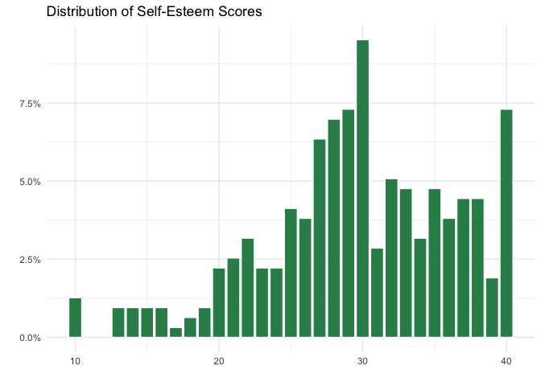<!-- -->

``` r
# average self-esteem scores
ggplot(survey_data, aes(x = RSE_Average, y = after_stat(prop), group = 1)) +
  geom_bar(fill = "seagreen", color = "white") +
  labs(title = "Distribution of Average Self-Esteem Scores",
       x = "",
       y = "") +
  theme_minimal() +
  scale_y_continuous(labels = scales::percent_format())
```

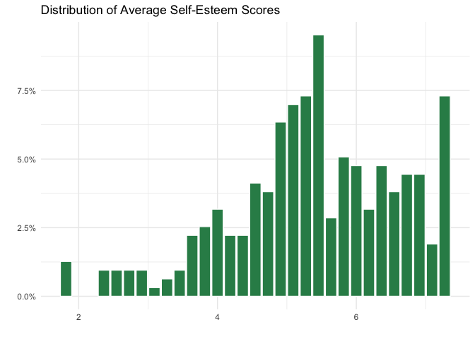<!-- -->

# Overview of Demographics

``` r
# Age 
ggplot(survey_data, aes(x = Age, y = after_stat(prop), group = 1)) +
  geom_bar(fill = "skyblue") +
  labs(title = "Age Group Distribution", y = "", x ="") +
  theme_minimal() +
  scale_y_continuous(labels = scales::percent_format())
```

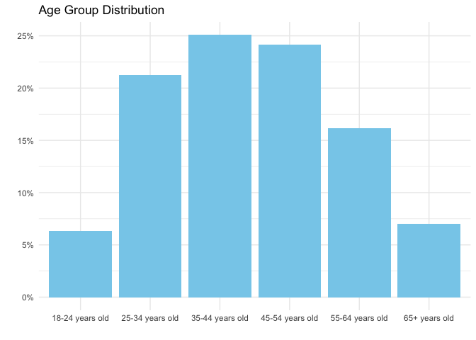<!-- -->

``` r
# Employment
ggplot(survey_data, aes(x = Employment, y = after_stat(prop), group = 1)) +
  geom_bar(fill = "skyblue") +
  labs(title = "Employment Group Distribution", y = "", x ="") +
  theme_minimal() +
  theme(axis.text.x = element_text(angle = 55, hjust = 1)) +
  scale_y_continuous(labels = scales::percent_format()) 
```

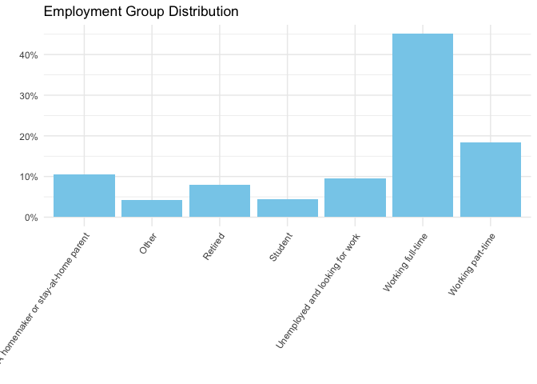<!-- -->

``` r
# Marital Status
ggplot(survey_data, aes(x = MaritalStatus, y = after_stat(prop), group = 1)) +
  geom_bar(fill = "skyblue") +
  labs(title = "Marital Status Distribution", y = "", x = "") +
  theme_minimal() +
  scale_y_continuous(labels = scales::percent_format())
```

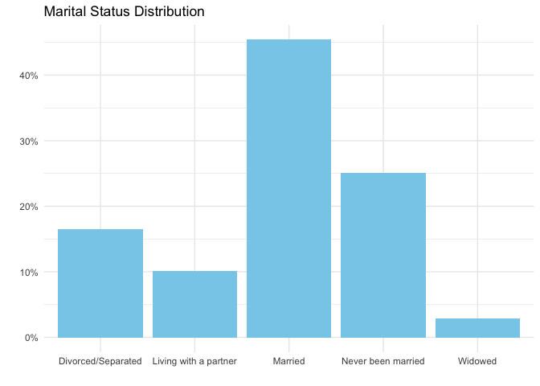<!-- -->

``` r
# Income Status
ggplot(survey_data, aes(x = Income, y = after_stat(prop), group = 1)) +
  geom_bar(fill = "skyblue") +
  labs(title = "Income Status Distribution", y = "", x = "") +
  theme_minimal() +
  theme(axis.text.x = element_text(angle = 25, hjust = 1)) +
  scale_y_continuous(labels = scales::percent_format())
```

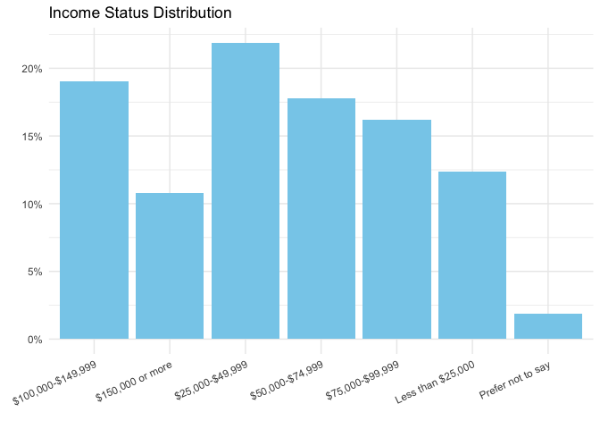<!-- -->

# Describing the Data

``` r
# Time to take survey
ggplot(survey_data, aes(x = Duration_sec)) +
  geom_histogram(binwidth = 10, fill = "skyblue", color = "black") +
  labs(title = "Survey Completion Time Distribution",
       x = "Duration (seconds)", 
       y = "Number of Participants")
```

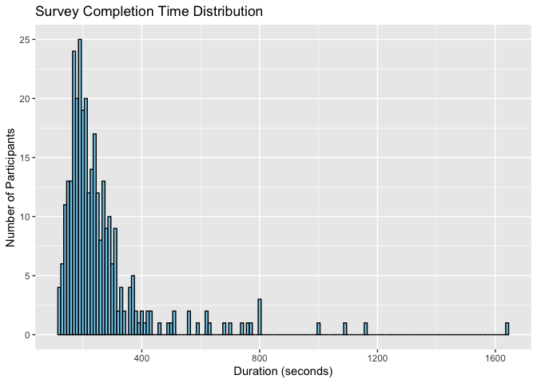<!-- -->

``` r
# Use Social media?
ggplot(survey_data, aes(x = UsesSocialMedia, y = after_stat(prop), group = 1)) +
  geom_bar(fill = "skyblue") +
  scale_y_continuous(labels = scales::percent_format()) +
  labs(title = "Do you use any form of social media?", x = "", y = "")
```

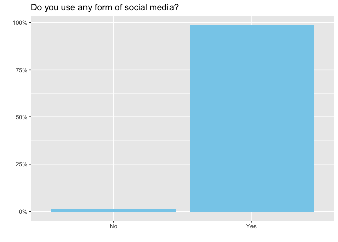<!-- -->

``` r
# Social Media Platforms
# Split platforms into separate rows to graph
platforms_long <- survey_data %>%
  separate_rows(PlatformsUsed, sep = ",\\s*")  

ggplot(platforms_long, aes(x = PlatformsUsed, y = after_stat(prop), group = 1)) +
  geom_bar(fill = "skyblue") +
  labs(title = "Which social media do you use?", x = "", y = "") +
  scale_y_continuous(labels = scales::percent_format()) +
  theme(axis.text.x = element_text(angle = 25, hjust = 1))
```

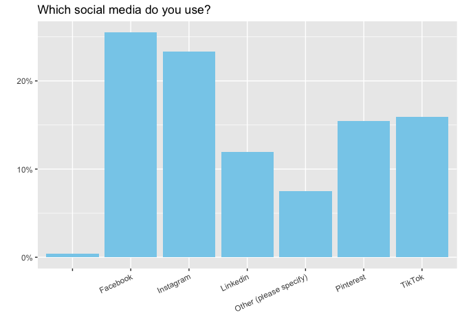<!-- -->

``` r
# other platforms people use - 
# X, Snapchat, Reddit, Twitter, YouTube, Truth Social, Bluesky, Tumblr, Nextdoor, Threads, Whatsapp, Discord
unique(survey_data$OtherPlatforms)
```

    ##  [1] ""                                           
    ##  [2] "Reddit, Goodreads"                          
    ##  [3] "X"                                          
    ##  [4] "Snapchat"                                   
    ##  [5] "Reddit"                                     
    ##  [6] "Snapchat "                                  
    ##  [7] "Twitter"                                    
    ##  [8] "whatsapp"                                   
    ##  [9] "reddit"                                     
    ## [10] "Twitter, Reddit"                            
    ## [11] "YouTube"                                    
    ## [12] "you tube"                                   
    ## [13] "X and Truth Social "                        
    ## [14] "YouTube "                                   
    ## [15] "Reddit, X"                                  
    ## [16] "Snapchat, Reddit"                           
    ## [17] "twitter/x"                                  
    ## [18] "YouTube, Reddit"                            
    ## [19] "twitter, reddit"                            
    ## [20] "Twitter "                                   
    ## [21] "Bluesky"                                    
    ## [22] "Youtube"                                    
    ## [23] "bluesky"                                    
    ## [24] "Bsky, reddit "                              
    ## [25] "BlueSky"                                    
    ## [26] "Bluesky, Reddit"                            
    ## [27] "BlueSky, YouTube, Reddit, Twitter"          
    ## [28] "Threads"                                    
    ## [29] "Tumblr"                                     
    ## [30] "Reddit, Tumblr, X"                          
    ## [31] "Nextdoor"                                   
    ## [32] "Tumblr, Snapchat, X, Threads and Letterboxd"
    ## [33] "threads"                                    
    ## [34] "YouTube, X, Reddit"                         
    ## [35] "YouTube Snapchat "                          
    ## [36] "x (twitter)"                                
    ## [37] "snapchat"                                   
    ## [38] "Discord"                                    
    ## [39] "youtube, X"                                 
    ## [40] "reddit, bluesky, threads, snapchat"         
    ## [41] "x"                                          
    ## [42] "Truth "

``` r
# Hours per day
ggplot(survey_data, aes(x = HoursPerDay, y = after_stat(prop), group = 1)) +
  geom_bar(fill = "skyblue") +
  labs(title = "How many hours per day do you spend on social media?", x = "", y = "") +
  scale_y_continuous(labels = scales::percent_format()) 
```

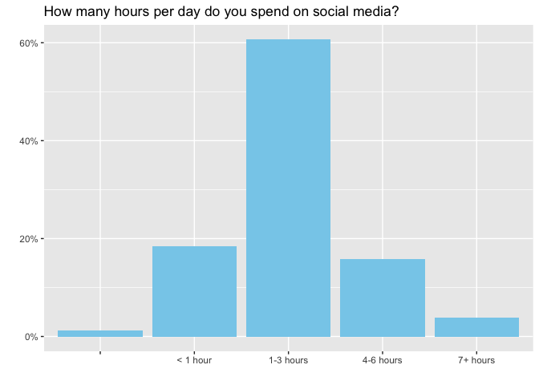<!-- -->

``` r
# Main purpose in using social media
ggplot(survey_data, aes(x = MainPurpose, y = after_stat(prop), group = 1)) +
  geom_bar(fill = "skyblue") +
  labs(title = "What is your main purpose for using social media? ", x = "", y = "") +
  theme(axis.text.x = element_text(angle = 25, hjust = 1)) +
  scale_y_continuous(labels = scales::percent_format()) 
```

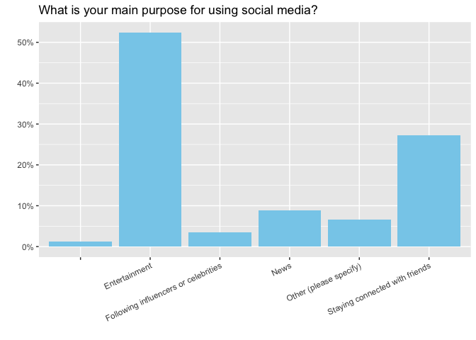<!-- -->

``` r
# other reasons
unique(survey_data$OtherReasons)
```

    ##  [1] "Marketing for work"                                                                          
    ##  [2] ""                                                                                            
    ##  [3] "Marketing"                                                                                   
    ##  [4] "Marketing my small business "                                                                
    ##  [5] "Special interest groups "                                                                    
    ##  [6] "staying connected to the world (including news, health, friends, trends, fashion, humor etc)"
    ##  [7] "Business promotion"                                                                          
    ##  [8] "Politics"                                                                                    
    ##  [9] "Job related groups and postings"                                                             
    ## [10] "mental health help"                                                                          
    ## [11] "Learning"                                                                                    
    ## [12] "Groups I run or have an interest in."                                                        
    ## [13] "Promoting my art"                                                                            
    ## [14] "Local happenings"                                                                            
    ## [15] "following spiritual authors, teachers, speakers"                                             
    ## [16] "Work"                                                                                        
    ## [17] "typically health related content and food recipes "                                          
    ## [18] "recipes. comedy"                                                                             
    ## [19] "finding out exactly what's gong on in our federal government"                                
    ## [20] "Facebook Groups"                                                                             
    ## [21] "Messaging family members"

``` r
# How Often do they Interact with Influencers
ggplot(survey_data, aes(x = InteractWithInfluencers, y = after_stat(prop), group = 1)) +
  geom_bar(fill = "skyblue") +
  labs(title = "How often do you interact with influencer content (viewing, following, liking or commenting)?", x = "", y = "") +
  scale_y_continuous(labels = scales::percent_format()) 
```

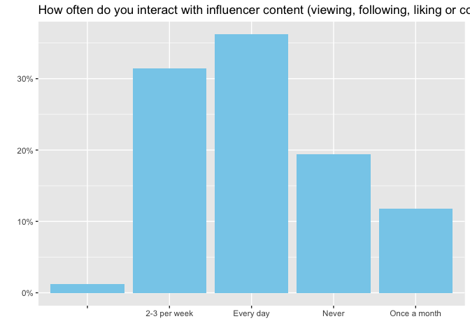<!-- -->

``` r
# Influencers they know
# Split influencers into separate rows to graph
influencers_long <- survey_data %>%
  separate_rows(FamiliarInfluencers, sep = ",\\s*")  

ggplot(influencers_long, aes(x = FamiliarInfluencers, y = after_stat(prop), group = 1)) +
  geom_bar(fill = "skyblue") +
  labs(title = "Which of the following influencers are you familiar with?", x = "", y = "") +
  theme(axis.text.x = element_text(angle = 25, hjust = 1)) +
  scale_y_continuous(labels = scales::percent_format()) 
```

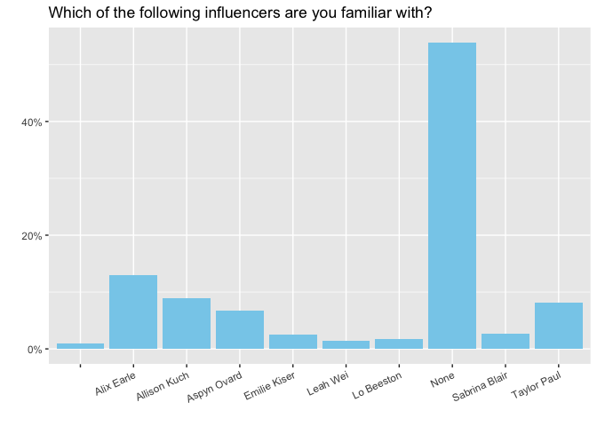<!-- -->

``` r
# table of which influencers they know
influencers_long %>%
  group_by(FamiliarInfluencers) %>%
  summarise(count = n()) %>%
  mutate(percent = (count / sum(count)) * 100)
```

    ## # A tibble: 10 × 3
    ##    FamiliarInfluencers count percent
    ##    <chr>               <int>   <dbl>
    ##  1 ""                      4   0.993
    ##  2 "Alix Earle"           52  12.9  
    ##  3 "Allison Kuch"         36   8.93 
    ##  4 "Aspyn Ovard"          27   6.70 
    ##  5 "Emilie Kiser"         10   2.48 
    ##  6 "Leah Wei"              6   1.49 
    ##  7 "Lo Beeston"            7   1.74 
    ##  8 "None"                217  53.8  
    ##  9 "Sabrina Blair"        11   2.73 
    ## 10 "Taylor Paul"          33   8.19

# Parasocial Relationships

Adapted the Celebrity-Persona Parasocial Interaction Scale.
“Participants are asked to rank their level of agreement with statements
about their parasocial interaction with celebrities on a five-level
scale: strongly disagree, disagree, neutral, agree, and strongly agree.”
Strongly disagree is 1 and it goes up to strongly agree, which is 5. The
scale doesn’t say to total it or average it, or reverse order anything,
but the higher the score, the stronger parasocial relationship you have.

``` r
# Rename columns
survey_data <- survey_data %>%
  rename(
    PSR_1 = `X..ImportId...QID37_1..`,
    PSR_2 = `X..ImportId...QID37_2..`,
    PSR_3 = `X..ImportId...QID37_3..`,
    PSR_4 = `X..ImportId...QID37_4..`,
    PSR_5 = `X..ImportId...QID37_5..`,
    PSR_6 = `X..ImportId...QID37_6..`,
    PSR_7 = `X..ImportId...QID37_7..`,
    PSR_8 = `X..ImportId...QID37_8..`,
  )


survey_data <- survey_data %>%
  mutate(across(starts_with("PSR"),  
                ~ case_when(
                  . == "Strongly Disagree" ~ 1,
                  . == "Disagree" ~ 2,
                  . == "Neutral" ~ 3,
                  . == "Agree" ~ 4,
                  . == "Strongly Agree" ~ 5
                )))

# Calculate total and average and make them new columns
survey_data <- survey_data %>%
  rowwise() %>%
  mutate(
    PSR_Total = sum(c_across(starts_with("PSR_")), na.rm = TRUE),
    PSR_Average = mean(c_across(starts_with("PSR_")), na.rm = TRUE)
  ) %>%
  ungroup()

summary(survey_data$PSR_Total)
```

    ##    Min. 1st Qu.  Median    Mean 3rd Qu.    Max. 
    ##    8.00   11.00   15.00   15.68   18.00   40.00

``` r
summary(survey_data$PSR_Average)
```

    ##    Min. 1st Qu.  Median    Mean 3rd Qu.    Max. 
    ##   1.778   2.444   3.333   3.484   4.000   8.889

``` r
# total PSR
ggplot(survey_data, aes(x = PSR_Total)) +
  geom_histogram(binwidth = 2, fill = "lightblue", color = "white") +
  labs(title = "Distribution of PSR Scores",
       x = "Total PSR Score",
       y = "Count") +
  theme_minimal()
```

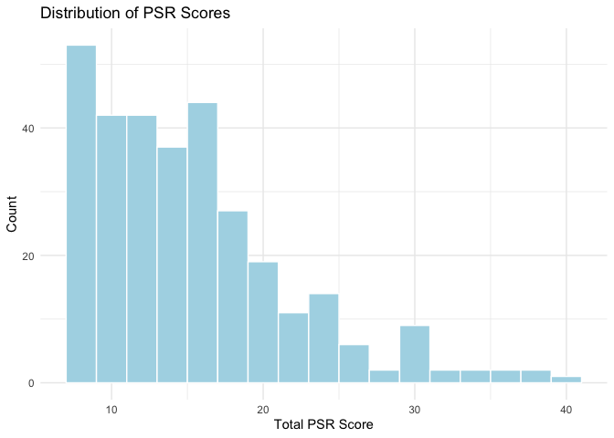<!-- -->

``` r
# average PSR
ggplot(survey_data, aes(x = PSR_Average)) +
  geom_histogram(fill = "lightblue", color = "white") +
  labs(title = "Distribution of Average PSR Scores",
       x = "Average PSR Score",
       y = "Count") +
  theme_minimal()
```

    ## `stat_bin()` using `bins = 30`. Pick better value with `binwidth`.

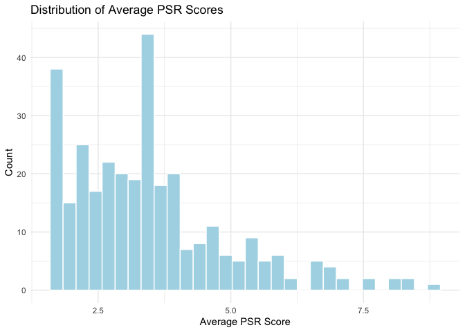<!-- -->

# Brand Ratings

Q35(Old Navy) & Q39(Lululemon)

``` r
# rename
brand_ratings <- survey_data %>%
  rename(
    Q35_1 = `X..ImportId...QID35_1..`,
    Q35_2 = `X..ImportId...QID35_2..`,
    Q35_3 = `X..ImportId...QID35_3..`,
    Q39_1 = `X..ImportId...QID39_1..`,
    Q39_2 = `X..ImportId...QID39_2..`,
    Q39_3 = `X..ImportId...QID39_3..`,
  )

# average brand ratings for Q35 & Q39
brand_ratings <- brand_ratings %>%
  rowwise() %>%
  mutate(
    Q35_Average = mean(c(Q35_1, Q35_2, Q35_3), na.rm = TRUE),
    Q39_Average = mean(c(Q39_1, Q39_2, Q39_3), na.rm = TRUE)
  ) %>%
  ungroup()

# put graphs side by side
long_data <- brand_ratings %>%
  pivot_longer(cols = c(Q35_Average, Q39_Average), 
               names_to = "Brand", 
               values_to = "Average_Rating") %>%
  mutate(BrandCheck = factor(BrandCheck, levels = c("Old Navy", "Lululemon")))

ggplot(long_data, aes(x = BrandCheck, y = Average_Rating, fill = BrandCheck)) +
  geom_boxplot() +
  labs(title = "Brand Ratings Comparison", y = "", x = "") +
  theme_minimal() +
  scale_fill_manual(values = c("Old Navy" = "navyblue", "Lululemon" = "lightcoral"))
```

    ## Warning: Removed 315 rows containing non-finite outside the scale range
    ## (`stat_boxplot()`).

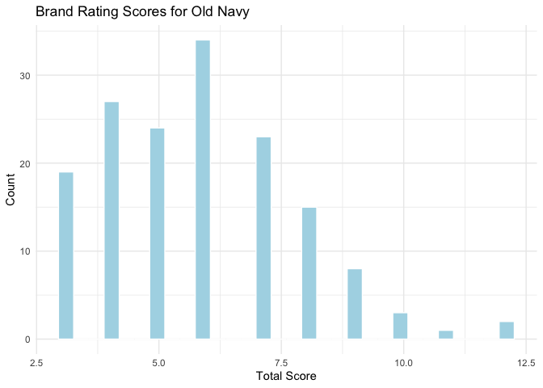<!-- -->

# T-tests

``` r
# Self-esteem and groups: Lululemon & Old Navy
t_test_result_RSE <- t.test(RSE_Total ~ BrandCheck, data = survey_data)
print(t_test_result_RSE)
```

    ## 
    ##  Welch Two Sample t-test
    ## 
    ## data:  RSE_Total by BrandCheck
    ## t = 1.1961, df = 311.78, p-value = 0.2326
    ## alternative hypothesis: true difference in means between group Lululemon and group Old Navy is not equal to 0
    ## 95 percent confidence interval:
    ##  -0.58469  2.39779
    ## sample estimates:
    ## mean in group Lululemon  mean in group Old Navy 
    ##                30.05590                29.14935

``` r
# Parasocial relationships and groups: Lululemon & Old Navy
t_test_result_PSR <- t.test(PSR_Total ~ BrandCheck, data = survey_data)
print(t_test_result_PSR)
```

    ## 
    ##  Welch Two Sample t-test
    ## 
    ## data:  PSR_Total by BrandCheck
    ## t = 1.1815, df = 304.99, p-value = 0.2383
    ## alternative hypothesis: true difference in means between group Lululemon and group Old Navy is not equal to 0
    ## 95 percent confidence interval:
    ##  -0.5760642  2.3072895
    ## sample estimates:
    ## mean in group Lululemon  mean in group Old Navy 
    ##                16.09938                15.23377

``` r
# Interested to see if self esteem was effected by hours per day spent on social media
t_test_result_hours <- aov(RSE_Total ~ HoursPerDay, data = survey_data)
summary(t_test_result_hours)
```

    ##              Df Sum Sq Mean Sq F value Pr(>F)
    ## HoursPerDay   4    105   26.33   0.579  0.678
    ## Residuals   310  14099   45.48

``` r
# parasocial relationships and hours per day is significant! 
hours_per_day_test_PSR <- aov(PSR_Total ~ HoursPerDay, data = survey_data)
summary(hours_per_day_test_PSR)
```

    ##              Df Sum Sq Mean Sq F value  Pr(>F)   
    ## HoursPerDay   4    629  157.15   3.813 0.00483 **
    ## Residuals   310  12776   41.21                   
    ## ---
    ## Signif. codes:  0 '***' 0.001 '**' 0.01 '*' 0.05 '.' 0.1 ' ' 1

``` r
# main purpose is also significant with PSR, not with RSE
main_purpose_test_PSR <- aov(PSR_Total ~ MainPurpose, data = survey_data)
summary(main_purpose_test_PSR)
```

    ##              Df Sum Sq Mean Sq F value  Pr(>F)   
    ## MainPurpose   5    713  142.62   3.472 0.00455 **
    ## Residuals   309  12692   41.07                   
    ## ---
    ## Signif. codes:  0 '***' 0.001 '**' 0.01 '*' 0.05 '.' 0.1 ' ' 1

``` r
main_purpose_test_RSE <- aov(RSE_Total ~ MainPurpose, data = survey_data)
summary(main_purpose_test_RSE)
```

    ##              Df Sum Sq Mean Sq F value Pr(>F)
    ## MainPurpose   5    311   62.19   1.383   0.23
    ## Residuals   309  13894   44.96

``` r
# interacting with influencers is significant on PSR, not with RSE
Interaction_with_influencers_test_PSR <- aov(PSR_Total ~ InteractWithInfluencers, data = survey_data)
summary(Interaction_with_influencers_test_PSR)
```

    ##                          Df Sum Sq Mean Sq F value   Pr(>F)    
    ## InteractWithInfluencers   4   1336   334.0   8.579 1.41e-06 ***
    ## Residuals               310  12069    38.9                     
    ## ---
    ## Signif. codes:  0 '***' 0.001 '**' 0.01 '*' 0.05 '.' 0.1 ' ' 1

``` r
Interaction_with_influencers_test_RSE <- aov(RSE_Total ~ InteractWithInfluencers, data = survey_data)
summary(Interaction_with_influencers_test_RSE)
```

    ##                          Df Sum Sq Mean Sq F value Pr(>F)
    ## InteractWithInfluencers   4    122   30.53   0.672  0.612
    ## Residuals               310  14083   45.43

``` r
# Income significant with RSE
income_test <- aov(RSE_Total ~ Income, data = survey_data)
summary(income_test)
```

    ##              Df Sum Sq Mean Sq F value Pr(>F)  
    ## Income        6    617  102.86   2.332 0.0323 *
    ## Residuals   308  13588   44.12                 
    ## ---
    ## Signif. codes:  0 '***' 0.001 '**' 0.01 '*' 0.05 '.' 0.1 ' ' 1

``` r
# Marital status significant with RSE
marital_test <- aov(RSE_Total ~ MaritalStatus, data = survey_data)
summary(marital_test)
```

    ##                Df Sum Sq Mean Sq F value  Pr(>F)   
    ## MaritalStatus   4    759  189.67   4.373 0.00187 **
    ## Residuals     310  13446   43.37                   
    ## ---
    ## Signif. codes:  0 '***' 0.001 '**' 0.01 '*' 0.05 '.' 0.1 ' ' 1
