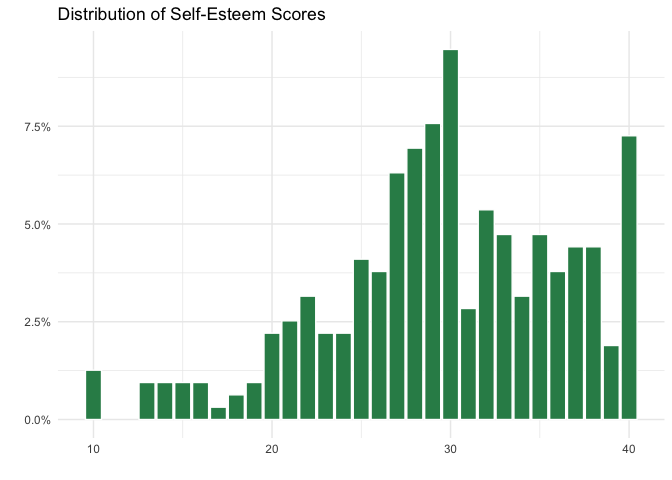
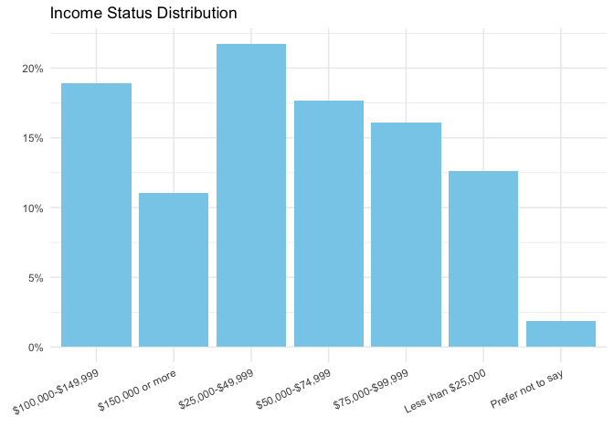
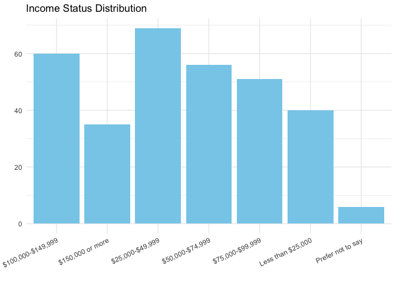

Influencer Marketing Survey 1
================
2025-03-15

- [Read in Data](#read-in-data)
- [Fix Column Names](#fix-column-names)
- [Filter the Data](#filter-the-data)
- [Recode the self-esteem Question](#recode-the-self-esteem-question)
- [Self-esteem](#self-esteem)
- [Overview of Demographics](#overview-of-demographics)
- [Describing the Data](#describing-the-data)

``` r
library(tidyverse)
```

    ## ── Attaching core tidyverse packages ──────────────────────── tidyverse 2.0.0 ──
    ## ✔ dplyr     1.1.4     ✔ readr     2.1.5
    ## ✔ forcats   1.0.0     ✔ stringr   1.5.1
    ## ✔ ggplot2   3.5.1     ✔ tibble    3.2.1
    ## ✔ lubridate 1.9.3     ✔ tidyr     1.3.1
    ## ✔ purrr     1.0.2     
    ## ── Conflicts ────────────────────────────────────────── tidyverse_conflicts() ──
    ## ✖ dplyr::filter() masks stats::filter()
    ## ✖ dplyr::lag()    masks stats::lag()
    ## ℹ Use the conflicted package (<http://conflicted.r-lib.org/>) to force all conflicts to become errors

``` r
library(tidyr)
library(dplyr)
```

# Read in Data

``` r
survey_data <- read.csv("~/Downloads/im_study - Copy_March 17, 2025_10.43.csv", skip = 2)
head(survey_data)
```

    ##   X..ImportId...startDate...timeZone...America.Denver..
    ## 1                                   2025-03-14 14:29:20
    ## 2                                   2025-03-14 14:39:26
    ## 3                                   2025-03-14 14:38:22
    ## 4                                   2025-03-14 14:40:03
    ## 5                                   2025-03-14 14:40:26
    ## 6                                   2025-03-14 14:42:05
    ##   X..ImportId...endDate...timeZone...America.Denver.. X..ImportId...status..
    ## 1                                 2025-03-14 14:30:32         Survey Preview
    ## 2                                 2025-03-14 14:42:15             IP Address
    ## 3                                 2025-03-14 14:42:31             IP Address
    ## 4                                 2025-03-14 14:43:03             IP Address
    ## 5                                 2025-03-14 14:43:34             IP Address
    ## 6                                 2025-03-14 14:45:08             IP Address
    ##   X..ImportId...ipAddress.. X..ImportId...progress.. X..ImportId...duration..
    ## 1                                                100                       71
    ## 2             70.171.95.151                      100                      169
    ## 3             98.196.247.78                      100                      249
    ## 4            149.106.50.133                      100                      180
    ## 5            97.119.155.189                      100                      188
    ## 6             47.209.14.104                      100                      183
    ##   X..ImportId...finished..
    ## 1                     True
    ## 2                     True
    ## 3                     True
    ## 4                     True
    ## 5                     True
    ## 6                     True
    ##   X..ImportId...recordedDate...timeZone...America.Denver..
    ## 1                                      2025-03-14 14:30:32
    ## 2                                      2025-03-14 14:42:16
    ## 3                                      2025-03-14 14:42:32
    ## 4                                      2025-03-14 14:43:04
    ## 5                                      2025-03-14 14:43:35
    ## 6                                      2025-03-14 14:45:09
    ##   X..ImportId..._recordId.. X..ImportId...recipientLastName..
    ## 1         R_7ouRxwqsnwBcZlz                                NA
    ## 2         R_6dd9BuKWbyyUMUo                                NA
    ## 3         R_13yGgx8oL7XpmWA                                NA
    ## 4         R_6hEhLNwdVlnzpJa                                NA
    ## 5         R_34zEuZf8YCbdwHv                                NA
    ## 6         R_1TfgObMd02FYnOF                                NA
    ##   X..ImportId...recipientFirstName.. X..ImportId...recipientEmail..
    ## 1                                 NA                             NA
    ## 2                                 NA                             NA
    ## 3                                 NA                             NA
    ## 4                                 NA                             NA
    ## 5                                 NA                             NA
    ## 6                                 NA                             NA
    ##   X..ImportId...externalDataReference.. X..ImportId...locationLatitude..
    ## 1                                    NA                          40.2329
    ## 2                                    NA                          30.0035
    ## 3                                    NA                          29.7376
    ## 4                                    NA                          36.4215
    ## 5                                    NA                          41.2884
    ## 6                                    NA                          37.6521
    ##   X..ImportId...locationLongitude.. X..ImportId...distributionChannel..
    ## 1                         -111.6688                             preview
    ## 2                          -90.0607                           anonymous
    ## 3                          -95.5210                           anonymous
    ## 4                          -84.9384                           anonymous
    ## 5                          -95.9972                           anonymous
    ## 6                         -118.9698                           anonymous
    ##   X..ImportId...userLanguage.. X..ImportId...Q_RecaptchaScore..
    ## 1                           EN                              1.0
    ## 2                           EN                              1.0
    ## 3                           EN                              1.0
    ## 4                           EN                              0.9
    ## 5                           EN                              0.9
    ## 6                           EN                              1.0
    ##   X..ImportId...QID22.. X..ImportId...QID1..
    ## 1                Female                   No
    ## 2                Female                  Yes
    ## 3                Female                  Yes
    ## 4                Female                  Yes
    ## 5                Female                  Yes
    ## 6                Female                  Yes
    ##                           X..ImportId...QID5.. X..ImportId...QID5_6_TEXT..
    ## 1                                                                         
    ## 2 Instagram,Facebook,TikTok,Pinterest,Linkedin                            
    ## 3           Instagram,Facebook,TikTok,Linkedin                            
    ## 4 Instagram,Facebook,TikTok,Pinterest,Linkedin                            
    ## 5                  Facebook,Pinterest,Linkedin                            
    ## 6        Instagram,Facebook,Pinterest,Linkedin                            
    ##   X..ImportId...QID6..  X..ImportId...QID20.. X..ImportId...QID20_5_TEXT..
    ## 1                                                                         
    ## 2            1-3 hours Other (please specify)           Marketing for work
    ## 3             7+ hours          Entertainment                             
    ## 4             < 1 hour          Entertainment                             
    ## 5             < 1 hour          Entertainment                             
    ## 6            1-3 hours Other (please specify)                    Marketing
    ##   X..ImportId...QID21..              X..ImportId...QID40..
    ## 1                                                         
    ## 2             Every day Alix Earle,Aspyn Ovard,Taylor Paul
    ## 3             Every day                               None
    ## 4          2-3 per week                               None
    ## 5                 Never                               None
    ## 6             Every day             Taylor Paul,Lo Beeston
    ##   X..ImportId...QID53_FIRST_CLICK.. X..ImportId...QID53_LAST_CLICK..
    ## 1                                NA                               NA
    ## 2                                NA                               NA
    ## 3                                NA                               NA
    ## 4                             1.918                           33.096
    ## 5                                NA                               NA
    ## 6                            14.043                           14.043
    ##   X..ImportId...QID53_PAGE_SUBMIT.. X..ImportId...QID53_CLICK_COUNT..
    ## 1                                NA                                NA
    ## 2                                NA                                NA
    ## 3                                NA                                NA
    ## 4                            33.722                                 5
    ## 5                                NA                                NA
    ## 6                            31.901                                 1
    ##   X..ImportId...QID52_FIRST_CLICK.. X..ImportId...QID52_LAST_CLICK..
    ## 1                             0.000                            0.000
    ## 2                            25.098                           25.098
    ## 3                            13.157                           35.076
    ## 4                                NA                               NA
    ## 5                             8.063                           34.053
    ## 6                                NA                               NA
    ##   X..ImportId...QID52_PAGE_SUBMIT.. X..ImportId...QID52_CLICK_COUNT..
    ## 1                            30.732                                 0
    ## 2                            37.853                                 1
    ## 3                            35.918                                 3
    ## 4                                NA                                NA
    ## 5                            35.387                                 8
    ## 6                                NA                                NA
    ##   X..ImportId...QID14.. X..ImportId...QID33.. X..ImportId...QID35_1..
    ## 1          Water bottle             Fabletics                      NA
    ## 2      Athletic Apparel              Old Navy                       2
    ## 3      Athletic Apparel              Old Navy                       3
    ## 4      Athletic Apparel              Old Navy                       2
    ## 5      Athletic Apparel              Old Navy                       3
    ## 6      Athletic Apparel             Lululemon                      NA
    ##   X..ImportId...QID35_2.. X..ImportId...QID35_3.. X..ImportId...QID39_1..
    ## 1                      NA                      NA                      NA
    ## 2                       2                       2                      NA
    ## 3                       3                       3                      NA
    ## 4                       3                       2                      NA
    ## 5                       2                       3                      NA
    ## 6                      NA                      NA                       4
    ##   X..ImportId...QID39_2.. X..ImportId...QID39_3.. X..ImportId...QID42..
    ## 1                      NA                      NA            Influencer
    ## 2                      NA                      NA            Influencer
    ## 3                      NA                      NA            Influencer
    ## 4                      NA                      NA            Influencer
    ## 5                      NA                      NA            Influencer
    ## 6                       4                       3            Influencer
    ##   X..ImportId...QID16.. X..ImportId...QID37_1.. X..ImportId...QID37_2..
    ## 1          Emilie Kiser                Disagree                Disagree
    ## 2          Emilie Kiser                Disagree                 Neutral
    ## 3          Emilie Kiser                 Neutral                   Agree
    ## 4          Emilie Kiser                 Neutral                   Agree
    ## 5          Emilie Kiser       Strongly Disagree       Strongly Disagree
    ## 6          Emilie Kiser       Strongly Disagree                 Neutral
    ##   X..ImportId...QID37_3.. X..ImportId...QID37_4.. X..ImportId...QID37_5..
    ## 1                Disagree                Disagree                Disagree
    ## 2                 Neutral                Disagree       Strongly Disagree
    ## 3                 Neutral                 Neutral       Strongly Disagree
    ## 4                 Neutral                 Neutral       Strongly Disagree
    ## 5       Strongly Disagree       Strongly Disagree       Strongly Disagree
    ## 6                 Neutral                Disagree       Strongly Disagree
    ##   X..ImportId...QID37_6.. X..ImportId...QID37_7.. X..ImportId...QID37_8..
    ## 1                Disagree                Disagree                Disagree
    ## 2       Strongly Disagree       Strongly Disagree       Strongly Disagree
    ## 3       Strongly Disagree       Strongly Disagree       Strongly Disagree
    ## 4       Strongly Disagree                Disagree       Strongly Disagree
    ## 5       Strongly Disagree       Strongly Disagree       Strongly Disagree
    ## 6       Strongly Disagree       Strongly Disagree       Strongly Disagree
    ##   X..ImportId...QID17_1.. X..ImportId...QID17_2.. X..ImportId...QID17_3..
    ## 1               2 (Agree)               2 (Agree)               2 (Agree)
    ## 2               2 (Agree)      1 (Strongly agree)               2 (Agree)
    ## 3      1 (Strongly agree)   4 (Strongly disagree)      1 (Strongly agree)
    ## 4               2 (Agree)   4 (Strongly disagree)               2 (Agree)
    ## 5      1 (Strongly agree)   4 (Strongly disagree)      1 (Strongly agree)
    ## 6            3 (Disagree)               2 (Agree)      1 (Strongly agree)
    ##   X..ImportId...QID17_4.. X..ImportId...QID17_5.. X..ImportId...QID17_6..
    ## 1               2 (Agree)               2 (Agree)               2 (Agree)
    ## 2               2 (Agree)      1 (Strongly agree)      1 (Strongly agree)
    ## 3      1 (Strongly agree)   4 (Strongly disagree)   4 (Strongly disagree)
    ## 4               2 (Agree)   4 (Strongly disagree)   4 (Strongly disagree)
    ## 5      1 (Strongly agree)   4 (Strongly disagree)   4 (Strongly disagree)
    ## 6               2 (Agree)            3 (Disagree)      1 (Strongly agree)
    ##   X..ImportId...QID17_7.. X..ImportId...QID17_8.. X..ImportId...QID17_9..
    ## 1               2 (Agree)               2 (Agree)               2 (Agree)
    ## 2            3 (Disagree)               2 (Agree)      1 (Strongly agree)
    ## 3      1 (Strongly agree)      1 (Strongly agree)   4 (Strongly disagree)
    ## 4               2 (Agree)      1 (Strongly agree)   4 (Strongly disagree)
    ## 5      1 (Strongly agree)   4 (Strongly disagree)   4 (Strongly disagree)
    ## 6               2 (Agree)               2 (Agree)               2 (Agree)
    ##   X..ImportId...QID17_10.. X..ImportId...QID7..
    ## 1                2 (Agree)             Under 18
    ## 2                2 (Agree)      35-44 years old
    ## 3       1 (Strongly agree)      35-44 years old
    ## 4                2 (Agree)      35-44 years old
    ## 5       1 (Strongly agree)      25-34 years old
    ## 6                2 (Agree)      25-34 years old
    ##                 X..ImportId...QID9.. X..ImportId...QID10..
    ## 1                  Working part-time    Divorced/Separated
    ## 2                  Working full-time               Married
    ## 3                  Working full-time               Married
    ## 4 A homemaker or stay-at-home parent Living with a partner
    ## 5                  Working full-time    Divorced/Separated
    ## 6                  Working part-time    Never been married
    ##   X..ImportId...QID47..
    ## 1       $75,000-$99,999
    ## 2      $150,000 or more
    ## 3       $50,000-$74,999
    ## 4     Less than $25,000
    ## 5     Less than $25,000
    ## 6     Less than $25,000

# Fix Column Names

``` r
# get rid of columns
survey_data <- survey_data %>%
  select(-c(X..ImportId...startDate...timeZone...America.Denver..,
            X..ImportId...endDate...timeZone...America.Denver.., 
            X..ImportId...finished.., # all were true
            X..ImportId...status..,  # all were IP address, besides the first one-Survey Preview
            X..ImportId...ipAddress.., 
            X..ImportId...progress..,  # all were 100
            X..ImportId...recordedDate...timeZone...America.Denver.., 
            X..ImportId...recipientLastName.., 
            X..ImportId...recipientFirstName.., 
            X..ImportId...recipientEmail.., 
            X..ImportId...externalDataReference.., 
            X..ImportId...locationLatitude.., 
            X..ImportId...locationLongitude.., 
            X..ImportId...distributionChannel..,  #all were anonymous, except first -preview
            X..ImportId...userLanguage..,  # all were english
            X..ImportId...QID53_FIRST_CLICK.., #dont think we need when they clicked on the page while viewing the ad?
            X..ImportId...QID53_LAST_CLICK..,
            X..ImportId...QID53_PAGE_SUBMIT..,
            X..ImportId...QID53_CLICK_COUNT..,
            X..ImportId...QID52_FIRST_CLICK..,
            X..ImportId...QID52_LAST_CLICK..,
            X..ImportId...QID52_PAGE_SUBMIT..,
            X..ImportId...QID52_CLICK_COUNT..
            ))

# rename column names
colnames(survey_data)
```

    ##  [1] "X..ImportId...duration.."         "X..ImportId..._recordId.."       
    ##  [3] "X..ImportId...Q_RecaptchaScore.." "X..ImportId...QID22.."           
    ##  [5] "X..ImportId...QID1.."             "X..ImportId...QID5.."            
    ##  [7] "X..ImportId...QID5_6_TEXT.."      "X..ImportId...QID6.."            
    ##  [9] "X..ImportId...QID20.."            "X..ImportId...QID20_5_TEXT.."    
    ## [11] "X..ImportId...QID21.."            "X..ImportId...QID40.."           
    ## [13] "X..ImportId...QID14.."            "X..ImportId...QID33.."           
    ## [15] "X..ImportId...QID35_1.."          "X..ImportId...QID35_2.."         
    ## [17] "X..ImportId...QID35_3.."          "X..ImportId...QID39_1.."         
    ## [19] "X..ImportId...QID39_2.."          "X..ImportId...QID39_3.."         
    ## [21] "X..ImportId...QID42.."            "X..ImportId...QID16.."           
    ## [23] "X..ImportId...QID37_1.."          "X..ImportId...QID37_2.."         
    ## [25] "X..ImportId...QID37_3.."          "X..ImportId...QID37_4.."         
    ## [27] "X..ImportId...QID37_5.."          "X..ImportId...QID37_6.."         
    ## [29] "X..ImportId...QID37_7.."          "X..ImportId...QID37_8.."         
    ## [31] "X..ImportId...QID17_1.."          "X..ImportId...QID17_2.."         
    ## [33] "X..ImportId...QID17_3.."          "X..ImportId...QID17_4.."         
    ## [35] "X..ImportId...QID17_5.."          "X..ImportId...QID17_6.."         
    ## [37] "X..ImportId...QID17_7.."          "X..ImportId...QID17_8.."         
    ## [39] "X..ImportId...QID17_9.."          "X..ImportId...QID17_10.."        
    ## [41] "X..ImportId...QID7.."             "X..ImportId...QID9.."            
    ## [43] "X..ImportId...QID10.."            "X..ImportId...QID47.."

``` r
survey_data <- survey_data %>%
  rename(
    Duration_sec = `X..ImportId...duration..`,
    RecordId = X..ImportId..._recordId..,
    RecaptchaScore = X..ImportId...Q_RecaptchaScore..,
    Gender = `X..ImportId...QID22..`,
    UsesSocialMedia = X..ImportId...QID1..,
    PlatformsUsed = X..ImportId...QID5..,
    OtherPlatforms = X..ImportId...QID5_6_TEXT..,
    HoursPerDay = X..ImportId...QID6..,
    MainPurpose = X..ImportId...QID20..,
    OtherReasons = X..ImportId...QID20_5_TEXT..,
    InteractWithInfluencers = X..ImportId...QID21..,
    FamiliarInfluencers = X..ImportId...QID40..,
    ProductCheck = X..ImportId...QID14..,
    BrandCheck = X..ImportId...QID33..,
    WhoPosted = X..ImportId...QID42..,
    Influencer = X..ImportId...QID16..,
    Age = X..ImportId...QID7..,
    Employment = X..ImportId...QID9..,
    MaritalStatus = X..ImportId...QID10..,
    Income = X..ImportId...QID47..
  )
head(survey_data)
```

    ##   Duration_sec          RecordId RecaptchaScore Gender UsesSocialMedia
    ## 1           71 R_7ouRxwqsnwBcZlz            1.0 Female              No
    ## 2          169 R_6dd9BuKWbyyUMUo            1.0 Female             Yes
    ## 3          249 R_13yGgx8oL7XpmWA            1.0 Female             Yes
    ## 4          180 R_6hEhLNwdVlnzpJa            0.9 Female             Yes
    ## 5          188 R_34zEuZf8YCbdwHv            0.9 Female             Yes
    ## 6          183 R_1TfgObMd02FYnOF            1.0 Female             Yes
    ##                                  PlatformsUsed OtherPlatforms HoursPerDay
    ## 1                                                                        
    ## 2 Instagram,Facebook,TikTok,Pinterest,Linkedin                  1-3 hours
    ## 3           Instagram,Facebook,TikTok,Linkedin                   7+ hours
    ## 4 Instagram,Facebook,TikTok,Pinterest,Linkedin                   < 1 hour
    ## 5                  Facebook,Pinterest,Linkedin                   < 1 hour
    ## 6        Instagram,Facebook,Pinterest,Linkedin                  1-3 hours
    ##              MainPurpose       OtherReasons InteractWithInfluencers
    ## 1                                                                  
    ## 2 Other (please specify) Marketing for work               Every day
    ## 3          Entertainment                                  Every day
    ## 4          Entertainment                               2-3 per week
    ## 5          Entertainment                                      Never
    ## 6 Other (please specify)          Marketing               Every day
    ##                  FamiliarInfluencers     ProductCheck BrandCheck
    ## 1                                        Water bottle  Fabletics
    ## 2 Alix Earle,Aspyn Ovard,Taylor Paul Athletic Apparel   Old Navy
    ## 3                               None Athletic Apparel   Old Navy
    ## 4                               None Athletic Apparel   Old Navy
    ## 5                               None Athletic Apparel   Old Navy
    ## 6             Taylor Paul,Lo Beeston Athletic Apparel  Lululemon
    ##   X..ImportId...QID35_1.. X..ImportId...QID35_2.. X..ImportId...QID35_3..
    ## 1                      NA                      NA                      NA
    ## 2                       2                       2                       2
    ## 3                       3                       3                       3
    ## 4                       2                       3                       2
    ## 5                       3                       2                       3
    ## 6                      NA                      NA                      NA
    ##   X..ImportId...QID39_1.. X..ImportId...QID39_2.. X..ImportId...QID39_3..
    ## 1                      NA                      NA                      NA
    ## 2                      NA                      NA                      NA
    ## 3                      NA                      NA                      NA
    ## 4                      NA                      NA                      NA
    ## 5                      NA                      NA                      NA
    ## 6                       4                       4                       3
    ##    WhoPosted   Influencer X..ImportId...QID37_1.. X..ImportId...QID37_2..
    ## 1 Influencer Emilie Kiser                Disagree                Disagree
    ## 2 Influencer Emilie Kiser                Disagree                 Neutral
    ## 3 Influencer Emilie Kiser                 Neutral                   Agree
    ## 4 Influencer Emilie Kiser                 Neutral                   Agree
    ## 5 Influencer Emilie Kiser       Strongly Disagree       Strongly Disagree
    ## 6 Influencer Emilie Kiser       Strongly Disagree                 Neutral
    ##   X..ImportId...QID37_3.. X..ImportId...QID37_4.. X..ImportId...QID37_5..
    ## 1                Disagree                Disagree                Disagree
    ## 2                 Neutral                Disagree       Strongly Disagree
    ## 3                 Neutral                 Neutral       Strongly Disagree
    ## 4                 Neutral                 Neutral       Strongly Disagree
    ## 5       Strongly Disagree       Strongly Disagree       Strongly Disagree
    ## 6                 Neutral                Disagree       Strongly Disagree
    ##   X..ImportId...QID37_6.. X..ImportId...QID37_7.. X..ImportId...QID37_8..
    ## 1                Disagree                Disagree                Disagree
    ## 2       Strongly Disagree       Strongly Disagree       Strongly Disagree
    ## 3       Strongly Disagree       Strongly Disagree       Strongly Disagree
    ## 4       Strongly Disagree                Disagree       Strongly Disagree
    ## 5       Strongly Disagree       Strongly Disagree       Strongly Disagree
    ## 6       Strongly Disagree       Strongly Disagree       Strongly Disagree
    ##   X..ImportId...QID17_1.. X..ImportId...QID17_2.. X..ImportId...QID17_3..
    ## 1               2 (Agree)               2 (Agree)               2 (Agree)
    ## 2               2 (Agree)      1 (Strongly agree)               2 (Agree)
    ## 3      1 (Strongly agree)   4 (Strongly disagree)      1 (Strongly agree)
    ## 4               2 (Agree)   4 (Strongly disagree)               2 (Agree)
    ## 5      1 (Strongly agree)   4 (Strongly disagree)      1 (Strongly agree)
    ## 6            3 (Disagree)               2 (Agree)      1 (Strongly agree)
    ##   X..ImportId...QID17_4.. X..ImportId...QID17_5.. X..ImportId...QID17_6..
    ## 1               2 (Agree)               2 (Agree)               2 (Agree)
    ## 2               2 (Agree)      1 (Strongly agree)      1 (Strongly agree)
    ## 3      1 (Strongly agree)   4 (Strongly disagree)   4 (Strongly disagree)
    ## 4               2 (Agree)   4 (Strongly disagree)   4 (Strongly disagree)
    ## 5      1 (Strongly agree)   4 (Strongly disagree)   4 (Strongly disagree)
    ## 6               2 (Agree)            3 (Disagree)      1 (Strongly agree)
    ##   X..ImportId...QID17_7.. X..ImportId...QID17_8.. X..ImportId...QID17_9..
    ## 1               2 (Agree)               2 (Agree)               2 (Agree)
    ## 2            3 (Disagree)               2 (Agree)      1 (Strongly agree)
    ## 3      1 (Strongly agree)      1 (Strongly agree)   4 (Strongly disagree)
    ## 4               2 (Agree)      1 (Strongly agree)   4 (Strongly disagree)
    ## 5      1 (Strongly agree)   4 (Strongly disagree)   4 (Strongly disagree)
    ## 6               2 (Agree)               2 (Agree)               2 (Agree)
    ##   X..ImportId...QID17_10..             Age                         Employment
    ## 1                2 (Agree)        Under 18                  Working part-time
    ## 2                2 (Agree) 35-44 years old                  Working full-time
    ## 3       1 (Strongly agree) 35-44 years old                  Working full-time
    ## 4                2 (Agree) 35-44 years old A homemaker or stay-at-home parent
    ## 5       1 (Strongly agree) 25-34 years old                  Working full-time
    ## 6                2 (Agree) 25-34 years old                  Working part-time
    ##           MaritalStatus            Income
    ## 1    Divorced/Separated   $75,000-$99,999
    ## 2               Married  $150,000 or more
    ## 3               Married   $50,000-$74,999
    ## 4 Living with a partner Less than $25,000
    ## 5    Divorced/Separated Less than $25,000
    ## 6    Never been married Less than $25,000

# Filter the Data

``` r
# only females
survey_data <- survey_data %>%
  filter(Gender == "Female")

# filter out people who took less than 60 seconds
survey_data <- survey_data %>%
  filter(Duration_sec >= 60)

# product check
survey_data <- survey_data %>%
  filter(ProductCheck == "Athletic Apparel") 

# brand check... checks if they chose lululemon or old navy (might need to fix this later bc they could 
# have just guessed) 
survey_data <- survey_data %>%
  filter(BrandCheck %in% c("Lululemon", "Old Navy"))

head(survey_data, 10)
```

    ##    Duration_sec          RecordId RecaptchaScore Gender UsesSocialMedia
    ## 1           169 R_6dd9BuKWbyyUMUo            1.0 Female             Yes
    ## 2           249 R_13yGgx8oL7XpmWA            1.0 Female             Yes
    ## 3           180 R_6hEhLNwdVlnzpJa            0.9 Female             Yes
    ## 4           188 R_34zEuZf8YCbdwHv            0.9 Female             Yes
    ## 5           183 R_1TfgObMd02FYnOF            1.0 Female             Yes
    ## 6           127 R_3VQGnXqeZazZQY3            1.0 Female             Yes
    ## 7           126 R_5oGVjARBB61jnSu            1.0 Female             Yes
    ## 8           123 R_7tZRK1rKhjm88il            1.0 Female             Yes
    ## 9           150 R_3qP5cP6q0RWnF2P            1.0 Female             Yes
    ## 10          262 R_5sSyWbwgKcOM1BG            1.0 Female             Yes
    ##                                                          PlatformsUsed
    ## 1                         Instagram,Facebook,TikTok,Pinterest,Linkedin
    ## 2                                   Instagram,Facebook,TikTok,Linkedin
    ## 3                         Instagram,Facebook,TikTok,Pinterest,Linkedin
    ## 4                                          Facebook,Pinterest,Linkedin
    ## 5                                Instagram,Facebook,Pinterest,Linkedin
    ## 6                   Instagram,Facebook,Linkedin,Other (please specify)
    ## 7                                            Instagram,Facebook,TikTok
    ## 8  Instagram,Facebook,TikTok,Pinterest,Linkedin,Other (please specify)
    ## 9                         Instagram,Facebook,TikTok,Pinterest,Linkedin
    ## 10                    Instagram,Facebook,TikTok,Other (please specify)
    ##       OtherPlatforms HoursPerDay                    MainPurpose
    ## 1                      1-3 hours         Other (please specify)
    ## 2                       7+ hours                  Entertainment
    ## 3                       < 1 hour                  Entertainment
    ## 4                       < 1 hour                  Entertainment
    ## 5                      1-3 hours         Other (please specify)
    ## 6  Reddit, Goodreads   1-3 hours                           News
    ## 7                      1-3 hours Staying connected with friends
    ## 8                  X    < 1 hour                  Entertainment
    ## 9                      1-3 hours                  Entertainment
    ## 10          Snapchat   1-3 hours Staying connected with friends
    ##          OtherReasons InteractWithInfluencers
    ## 1  Marketing for work               Every day
    ## 2                                   Every day
    ## 3                                2-3 per week
    ## 4                                       Never
    ## 5           Marketing               Every day
    ## 6                                   Every day
    ## 7                                   Every day
    ## 8                                   Every day
    ## 9                                Once a month
    ## 10                               2-3 per week
    ##                        FamiliarInfluencers     ProductCheck BrandCheck
    ## 1       Alix Earle,Aspyn Ovard,Taylor Paul Athletic Apparel   Old Navy
    ## 2                                     None Athletic Apparel   Old Navy
    ## 3                                     None Athletic Apparel   Old Navy
    ## 4                                     None Athletic Apparel   Old Navy
    ## 5                   Taylor Paul,Lo Beeston Athletic Apparel  Lululemon
    ## 6                                     None Athletic Apparel   Old Navy
    ## 7                                     None Athletic Apparel   Old Navy
    ## 8  Emilie Kiser,Allison Kuch,Sabrina Blair Athletic Apparel  Lululemon
    ## 9                                     None Athletic Apparel  Lululemon
    ## 10                                    None Athletic Apparel   Old Navy
    ##    X..ImportId...QID35_1.. X..ImportId...QID35_2.. X..ImportId...QID35_3..
    ## 1                        2                       2                       2
    ## 2                        3                       3                       3
    ## 3                        2                       3                       2
    ## 4                        3                       2                       3
    ## 5                       NA                      NA                      NA
    ## 6                        2                       2                       1
    ## 7                        2                       2                       2
    ## 8                       NA                      NA                      NA
    ## 9                       NA                      NA                      NA
    ## 10                       3                       2                       2
    ##    X..ImportId...QID39_1.. X..ImportId...QID39_2.. X..ImportId...QID39_3..
    ## 1                       NA                      NA                      NA
    ## 2                       NA                      NA                      NA
    ## 3                       NA                      NA                      NA
    ## 4                       NA                      NA                      NA
    ## 5                        4                       4                       3
    ## 6                       NA                      NA                      NA
    ## 7                       NA                      NA                      NA
    ## 8                        3                       3                       3
    ## 9                        4                       4                       4
    ## 10                      NA                      NA                      NA
    ##     WhoPosted   Influencer X..ImportId...QID37_1.. X..ImportId...QID37_2..
    ## 1  Influencer Emilie Kiser                Disagree                 Neutral
    ## 2  Influencer Emilie Kiser                 Neutral                   Agree
    ## 3  Influencer Emilie Kiser                 Neutral                   Agree
    ## 4  Influencer Emilie Kiser       Strongly Disagree       Strongly Disagree
    ## 5  Influencer Emilie Kiser       Strongly Disagree                 Neutral
    ## 6  Influencer Emilie Kiser       Strongly Disagree       Strongly Disagree
    ## 7  Influencer Emilie Kiser       Strongly Disagree       Strongly Disagree
    ## 8  Influencer Emilie Kiser       Strongly Disagree       Strongly Disagree
    ## 9  Influencer Emilie Kiser                Disagree                 Neutral
    ## 10 Influencer Emilie Kiser                 Neutral                   Agree
    ##    X..ImportId...QID37_3.. X..ImportId...QID37_4.. X..ImportId...QID37_5..
    ## 1                  Neutral                Disagree       Strongly Disagree
    ## 2                  Neutral                 Neutral       Strongly Disagree
    ## 3                  Neutral                 Neutral       Strongly Disagree
    ## 4        Strongly Disagree       Strongly Disagree       Strongly Disagree
    ## 5                  Neutral                Disagree       Strongly Disagree
    ## 6        Strongly Disagree       Strongly Disagree       Strongly Disagree
    ## 7        Strongly Disagree       Strongly Disagree       Strongly Disagree
    ## 8        Strongly Disagree       Strongly Disagree       Strongly Disagree
    ## 9                  Neutral                 Neutral                 Neutral
    ## 10                 Neutral                 Neutral                 Neutral
    ##    X..ImportId...QID37_6.. X..ImportId...QID37_7.. X..ImportId...QID37_8..
    ## 1        Strongly Disagree       Strongly Disagree       Strongly Disagree
    ## 2        Strongly Disagree       Strongly Disagree       Strongly Disagree
    ## 3        Strongly Disagree                Disagree       Strongly Disagree
    ## 4        Strongly Disagree       Strongly Disagree       Strongly Disagree
    ## 5        Strongly Disagree       Strongly Disagree       Strongly Disagree
    ## 6        Strongly Disagree       Strongly Disagree       Strongly Disagree
    ## 7        Strongly Disagree       Strongly Disagree       Strongly Disagree
    ## 8        Strongly Disagree       Strongly Disagree       Strongly Disagree
    ## 9                  Neutral                 Neutral                 Neutral
    ## 10       Strongly Disagree                 Neutral       Strongly Disagree
    ##    X..ImportId...QID17_1.. X..ImportId...QID17_2.. X..ImportId...QID17_3..
    ## 1                2 (Agree)      1 (Strongly agree)               2 (Agree)
    ## 2       1 (Strongly agree)   4 (Strongly disagree)      1 (Strongly agree)
    ## 3                2 (Agree)   4 (Strongly disagree)               2 (Agree)
    ## 4       1 (Strongly agree)   4 (Strongly disagree)      1 (Strongly agree)
    ## 5             3 (Disagree)               2 (Agree)      1 (Strongly agree)
    ## 6       1 (Strongly agree)               2 (Agree)               2 (Agree)
    ## 7                2 (Agree)            3 (Disagree)               2 (Agree)
    ## 8       1 (Strongly agree)   4 (Strongly disagree)      1 (Strongly agree)
    ## 9                2 (Agree)            3 (Disagree)               2 (Agree)
    ## 10               2 (Agree)            3 (Disagree)      1 (Strongly agree)
    ##    X..ImportId...QID17_4.. X..ImportId...QID17_5.. X..ImportId...QID17_6..
    ## 1                2 (Agree)      1 (Strongly agree)      1 (Strongly agree)
    ## 2       1 (Strongly agree)   4 (Strongly disagree)   4 (Strongly disagree)
    ## 3                2 (Agree)   4 (Strongly disagree)   4 (Strongly disagree)
    ## 4       1 (Strongly agree)   4 (Strongly disagree)   4 (Strongly disagree)
    ## 5                2 (Agree)            3 (Disagree)      1 (Strongly agree)
    ## 6             3 (Disagree)            3 (Disagree)               2 (Agree)
    ## 7                2 (Agree)            3 (Disagree)               2 (Agree)
    ## 8       1 (Strongly agree)   4 (Strongly disagree)   4 (Strongly disagree)
    ## 9                2 (Agree)            3 (Disagree)            3 (Disagree)
    ## 10      1 (Strongly agree)            3 (Disagree)               2 (Agree)
    ##    X..ImportId...QID17_7.. X..ImportId...QID17_8.. X..ImportId...QID17_9..
    ## 1             3 (Disagree)               2 (Agree)      1 (Strongly agree)
    ## 2       1 (Strongly agree)      1 (Strongly agree)   4 (Strongly disagree)
    ## 3                2 (Agree)      1 (Strongly agree)   4 (Strongly disagree)
    ## 4       1 (Strongly agree)   4 (Strongly disagree)   4 (Strongly disagree)
    ## 5                2 (Agree)               2 (Agree)               2 (Agree)
    ## 6                2 (Agree)               2 (Agree)            3 (Disagree)
    ## 7                2 (Agree)            3 (Disagree)            3 (Disagree)
    ## 8       1 (Strongly agree)               2 (Agree)   4 (Strongly disagree)
    ## 9                2 (Agree)            3 (Disagree)            3 (Disagree)
    ## 10      1 (Strongly agree)               2 (Agree)            3 (Disagree)
    ##    X..ImportId...QID17_10..             Age                         Employment
    ## 1                 2 (Agree) 35-44 years old                  Working full-time
    ## 2        1 (Strongly agree) 35-44 years old                  Working full-time
    ## 3                 2 (Agree) 35-44 years old A homemaker or stay-at-home parent
    ## 4        1 (Strongly agree) 25-34 years old                  Working full-time
    ## 5                 2 (Agree) 25-34 years old                  Working part-time
    ## 6                 2 (Agree) 35-44 years old                  Working full-time
    ## 7                 2 (Agree) 55-64 years old                  Working full-time
    ## 8        1 (Strongly agree) 25-34 years old                  Working full-time
    ## 9                 2 (Agree) 35-44 years old                  Working part-time
    ## 10                2 (Agree) 45-54 years old A homemaker or stay-at-home parent
    ##            MaritalStatus            Income
    ## 1                Married  $150,000 or more
    ## 2                Married   $50,000-$74,999
    ## 3  Living with a partner Less than $25,000
    ## 4     Divorced/Separated Less than $25,000
    ## 5     Never been married Less than $25,000
    ## 6                Married  $150,000 or more
    ## 7     Divorced/Separated  $150,000 or more
    ## 8                Married  $150,000 or more
    ## 9                Married   $25,000-$49,999
    ## 10               Married   $50,000-$74,999

# Recode the self-esteem Question

“scored by totaling the individual 4 point items after reverse-scoring
the negatively worded items.” higher score = better self-esteem

``` r
# Rename columns for simplicity
survey_data <- survey_data %>%
  rename(
    RSE_1 = `X..ImportId...QID17_1..`,
    RSE_2 = `X..ImportId...QID17_2..`,
    RSE_3 = `X..ImportId...QID17_3..`,
    RSE_4 = `X..ImportId...QID17_4..`,
    RSE_5 = `X..ImportId...QID17_5..`,
    RSE_6 = `X..ImportId...QID17_6..`,
    RSE_7 = `X..ImportId...QID17_7..`,
    RSE_8 = `X..ImportId...QID17_8..`,
    RSE_9 = `X..ImportId...QID17_9..`,
    RSE_10 = `X..ImportId...QID17_10..`
  )

# get just the number
survey_data <- survey_data %>%
  mutate(across(starts_with("RSE_"), ~ as.numeric(str_extract(., "^\\d"))))

# Reverse-scored items (2, 5, 6, 8, 9)
survey_data <- survey_data %>%
  mutate(across(c(RSE_2, RSE_5, RSE_6, RSE_8, RSE_9), ~ recode(., `1` = 4, `2` = 3, `3` = 2, `4` = 1)))

head(survey_data)
```

    ##   Duration_sec          RecordId RecaptchaScore Gender UsesSocialMedia
    ## 1          169 R_6dd9BuKWbyyUMUo            1.0 Female             Yes
    ## 2          249 R_13yGgx8oL7XpmWA            1.0 Female             Yes
    ## 3          180 R_6hEhLNwdVlnzpJa            0.9 Female             Yes
    ## 4          188 R_34zEuZf8YCbdwHv            0.9 Female             Yes
    ## 5          183 R_1TfgObMd02FYnOF            1.0 Female             Yes
    ## 6          127 R_3VQGnXqeZazZQY3            1.0 Female             Yes
    ##                                        PlatformsUsed    OtherPlatforms
    ## 1       Instagram,Facebook,TikTok,Pinterest,Linkedin                  
    ## 2                 Instagram,Facebook,TikTok,Linkedin                  
    ## 3       Instagram,Facebook,TikTok,Pinterest,Linkedin                  
    ## 4                        Facebook,Pinterest,Linkedin                  
    ## 5              Instagram,Facebook,Pinterest,Linkedin                  
    ## 6 Instagram,Facebook,Linkedin,Other (please specify) Reddit, Goodreads
    ##   HoursPerDay            MainPurpose       OtherReasons InteractWithInfluencers
    ## 1   1-3 hours Other (please specify) Marketing for work               Every day
    ## 2    7+ hours          Entertainment                                  Every day
    ## 3    < 1 hour          Entertainment                               2-3 per week
    ## 4    < 1 hour          Entertainment                                      Never
    ## 5   1-3 hours Other (please specify)          Marketing               Every day
    ## 6   1-3 hours                   News                                  Every day
    ##                  FamiliarInfluencers     ProductCheck BrandCheck
    ## 1 Alix Earle,Aspyn Ovard,Taylor Paul Athletic Apparel   Old Navy
    ## 2                               None Athletic Apparel   Old Navy
    ## 3                               None Athletic Apparel   Old Navy
    ## 4                               None Athletic Apparel   Old Navy
    ## 5             Taylor Paul,Lo Beeston Athletic Apparel  Lululemon
    ## 6                               None Athletic Apparel   Old Navy
    ##   X..ImportId...QID35_1.. X..ImportId...QID35_2.. X..ImportId...QID35_3..
    ## 1                       2                       2                       2
    ## 2                       3                       3                       3
    ## 3                       2                       3                       2
    ## 4                       3                       2                       3
    ## 5                      NA                      NA                      NA
    ## 6                       2                       2                       1
    ##   X..ImportId...QID39_1.. X..ImportId...QID39_2.. X..ImportId...QID39_3..
    ## 1                      NA                      NA                      NA
    ## 2                      NA                      NA                      NA
    ## 3                      NA                      NA                      NA
    ## 4                      NA                      NA                      NA
    ## 5                       4                       4                       3
    ## 6                      NA                      NA                      NA
    ##    WhoPosted   Influencer X..ImportId...QID37_1.. X..ImportId...QID37_2..
    ## 1 Influencer Emilie Kiser                Disagree                 Neutral
    ## 2 Influencer Emilie Kiser                 Neutral                   Agree
    ## 3 Influencer Emilie Kiser                 Neutral                   Agree
    ## 4 Influencer Emilie Kiser       Strongly Disagree       Strongly Disagree
    ## 5 Influencer Emilie Kiser       Strongly Disagree                 Neutral
    ## 6 Influencer Emilie Kiser       Strongly Disagree       Strongly Disagree
    ##   X..ImportId...QID37_3.. X..ImportId...QID37_4.. X..ImportId...QID37_5..
    ## 1                 Neutral                Disagree       Strongly Disagree
    ## 2                 Neutral                 Neutral       Strongly Disagree
    ## 3                 Neutral                 Neutral       Strongly Disagree
    ## 4       Strongly Disagree       Strongly Disagree       Strongly Disagree
    ## 5                 Neutral                Disagree       Strongly Disagree
    ## 6       Strongly Disagree       Strongly Disagree       Strongly Disagree
    ##   X..ImportId...QID37_6.. X..ImportId...QID37_7.. X..ImportId...QID37_8.. RSE_1
    ## 1       Strongly Disagree       Strongly Disagree       Strongly Disagree     2
    ## 2       Strongly Disagree       Strongly Disagree       Strongly Disagree     1
    ## 3       Strongly Disagree                Disagree       Strongly Disagree     2
    ## 4       Strongly Disagree       Strongly Disagree       Strongly Disagree     1
    ## 5       Strongly Disagree       Strongly Disagree       Strongly Disagree     3
    ## 6       Strongly Disagree       Strongly Disagree       Strongly Disagree     1
    ##   RSE_2 RSE_3 RSE_4 RSE_5 RSE_6 RSE_7 RSE_8 RSE_9 RSE_10             Age
    ## 1     4     2     2     4     4     3     3     4      2 35-44 years old
    ## 2     1     1     1     1     1     1     4     1      1 35-44 years old
    ## 3     1     2     2     1     1     2     4     1      2 35-44 years old
    ## 4     1     1     1     1     1     1     1     1      1 25-34 years old
    ## 5     3     1     2     2     4     2     3     3      2 25-34 years old
    ## 6     3     2     3     2     3     2     3     2      2 35-44 years old
    ##                           Employment         MaritalStatus            Income
    ## 1                  Working full-time               Married  $150,000 or more
    ## 2                  Working full-time               Married   $50,000-$74,999
    ## 3 A homemaker or stay-at-home parent Living with a partner Less than $25,000
    ## 4                  Working full-time    Divorced/Separated Less than $25,000
    ## 5                  Working part-time    Never been married Less than $25,000
    ## 6                  Working full-time               Married  $150,000 or more

``` r
# Calculate total and average and make them new columns
survey_data <- survey_data %>%
  rowwise() %>%
  mutate(
    RSE_Total = sum(c_across(starts_with("RSE_")), na.rm = TRUE),
    RSE_Average = mean(c_across(starts_with("RSE_")), na.rm = TRUE)
  ) %>%
  ungroup()

summary(survey_data$RSE_Total)
```

    ##    Min. 1st Qu.  Median    Mean 3rd Qu.    Max. 
    ##    10.0    15.0    20.0    20.4    24.0    40.0

# Self-esteem

``` r
# total self-esteem scores
ggplot(survey_data, aes(x = RSE_Total)) +
  geom_histogram(binwidth = 2, fill = "seagreen", color = "white") +
  labs(title = "Distribution of Self-Esteem Scores",
       x = "Total Self-Esteem Score",
       y = "Count") +
  theme_minimal()
```

<!-- -->

``` r
# average self-esteem scores
ggplot(survey_data, aes(x = RSE_Average)) +
  geom_histogram(fill = "seagreen", color = "white") +
  labs(title = "Distribution of Average Self-Esteem Scores",
       x = "Average Self-Esteem Score",
       y = "Count") +
  theme_minimal()
```

    ## `stat_bin()` using `bins = 30`. Pick better value with `binwidth`.

<!-- -->

# Overview of Demographics

``` r
# Age
ggplot(survey_data, aes(x = Age)) +
  geom_bar(fill = "skyblue") +
  labs(title = "Age Group Distribution", x = "Age Group", y = "Count")
```

<!-- -->

``` r
# Employment
ggplot(survey_data, aes(x = Employment)) +
  geom_bar(fill = "skyblue") +
  labs(title = "Employment Group Distribution", x = "Employment Group", y = "Count") +
  theme(axis.text.x = element_text(angle = 55, hjust = 1))
```

<!-- -->

``` r
# Marital Status
ggplot(survey_data, aes(x = MaritalStatus)) +
  geom_bar(fill = "skyblue") +
  labs(title = "Marital Status Distribution", x = "Marital Status", y = "Count") 
```

<!-- -->

``` r
# Income Status
ggplot(survey_data, aes(x = Income)) +
  geom_bar(fill = "skyblue") +
  labs(title = "Income Status Distribution", x = "Income Status", y = "Count") +
  theme(axis.text.x = element_text(angle = 25, hjust = 1))
```

<!-- -->

# Describing the Data

``` r
# Time to take survey
ggplot(survey_data, aes(x = Duration_sec)) +
  geom_histogram(binwidth = 10, fill = "skyblue", color = "black") +
  labs(title = "Survey Completion Time Distribution",
       x = "Duration (seconds)", 
       y = "Number of Participants")
```

<!-- -->

``` r
# Uses Social media?
ggplot(survey_data, aes(x = UsesSocialMedia)) +
  geom_bar(fill = "skyblue") +
  labs(title = "Do they use Social Media?", x = "Use social media?", y = "Count")
```

<!-- -->

``` r
# Social Media Platforms
# Split platforms into separate rows to graph
platforms_long <- survey_data %>%
  separate_rows(PlatformsUsed, sep = ",\\s*")  

ggplot(platforms_long, aes(x = PlatformsUsed)) +
  geom_bar(fill = "skyblue") +
  labs(title = "Social Media Platforms Used", x = "Platform", y = "Count") +
  theme(axis.text.x = element_text(angle = 25, hjust = 1))
```

<!-- -->

``` r
# other platforms people use - 
# X, Snapchat, Reddit, Twitter, YouTube, Truth Social, Bluesky, Tumblr, Nextdoor, Threads, Whatsapp, Discord
unique(survey_data$OtherPlatforms)
```

    ##  [1] ""                                           
    ##  [2] "Reddit, Goodreads"                          
    ##  [3] "X"                                          
    ##  [4] "Snapchat"                                   
    ##  [5] "Reddit"                                     
    ##  [6] "Snapchat "                                  
    ##  [7] "Twitter"                                    
    ##  [8] "whatsapp"                                   
    ##  [9] "reddit"                                     
    ## [10] "Twitter, Reddit"                            
    ## [11] "YouTube"                                    
    ## [12] "you tube"                                   
    ## [13] "X and Truth Social "                        
    ## [14] "YouTube "                                   
    ## [15] "Reddit, X"                                  
    ## [16] "Snapchat, Reddit"                           
    ## [17] "twitter/x"                                  
    ## [18] "YouTube, Reddit"                            
    ## [19] "twitter, reddit"                            
    ## [20] "Twitter "                                   
    ## [21] "Bluesky"                                    
    ## [22] "Youtube"                                    
    ## [23] "bluesky"                                    
    ## [24] "Bsky, reddit "                              
    ## [25] "BlueSky"                                    
    ## [26] "Bluesky, Reddit"                            
    ## [27] "BlueSky, YouTube, Reddit, Twitter"          
    ## [28] "Threads"                                    
    ## [29] "Tumblr"                                     
    ## [30] "Reddit, Tumblr, X"                          
    ## [31] "Nextdoor"                                   
    ## [32] "Tumblr, Snapchat, X, Threads and Letterboxd"
    ## [33] "threads"                                    
    ## [34] "YouTube, X, Reddit"                         
    ## [35] "YouTube Snapchat "                          
    ## [36] "x (twitter)"                                
    ## [37] "snapchat"                                   
    ## [38] "Discord"                                    
    ## [39] "youtube, X"                                 
    ## [40] "reddit, bluesky, threads, snapchat"         
    ## [41] "x"                                          
    ## [42] "Truth "

``` r
# Hours per day
ggplot(survey_data, aes(x = HoursPerDay)) +
  geom_bar(fill = "skyblue") +
  labs(title = "Hours Per Day Spent on Social Media", x = "Hours", y = "Count")
```

<!-- -->

``` r
# Main purpose in using social media
ggplot(survey_data, aes(x = MainPurpose)) +
  geom_bar(fill = "skyblue") +
  labs(title = "Main Purpose when Using Social Media", x = "Purpose", y = "Count") +
  theme(axis.text.x = element_text(angle = 25, hjust = 1))
```

<!-- -->

``` r
# other reasons
unique(survey_data$OtherReasons)
```

    ##  [1] "Marketing for work"                                                                          
    ##  [2] ""                                                                                            
    ##  [3] "Marketing"                                                                                   
    ##  [4] "Marketing my small business "                                                                
    ##  [5] "Special interest groups "                                                                    
    ##  [6] "staying connected to the world (including news, health, friends, trends, fashion, humor etc)"
    ##  [7] "Business promotion"                                                                          
    ##  [8] "Politics"                                                                                    
    ##  [9] "Job related groups and postings"                                                             
    ## [10] "mental health help"                                                                          
    ## [11] "Learning"                                                                                    
    ## [12] "Groups I run or have an interest in."                                                        
    ## [13] "Promoting my art"                                                                            
    ## [14] "Local happenings"                                                                            
    ## [15] "following spiritual authors, teachers, speakers"                                             
    ## [16] "Work"                                                                                        
    ## [17] "typically health related content and food recipes "                                          
    ## [18] "recipes. comedy"                                                                             
    ## [19] "finding out exactly what's gong on in our federal government"                                
    ## [20] "Facebook Groups"                                                                             
    ## [21] "Messaging family members"

``` r
# How Often do they Interact with Influencers
ggplot(survey_data, aes(x = InteractWithInfluencers)) +
  geom_bar(fill = "skyblue") +
  labs(title = "How Often do they Interact with Influencers", x = "Frequency", y = "Count")
```

<!-- -->

``` r
# Influencers they know
# Split influencers into separate rows to graph
influencers_long <- survey_data %>%
  separate_rows(FamiliarInfluencers, sep = ",\\s*")  

ggplot(influencers_long, aes(x = FamiliarInfluencers)) +
  geom_bar(fill = "skyblue") +
  labs(title = "Which Influencers they Know", x = "Influencer", y = "Count") +
  theme(axis.text.x = element_text(angle = 25, hjust = 1))
```

<!-- -->
